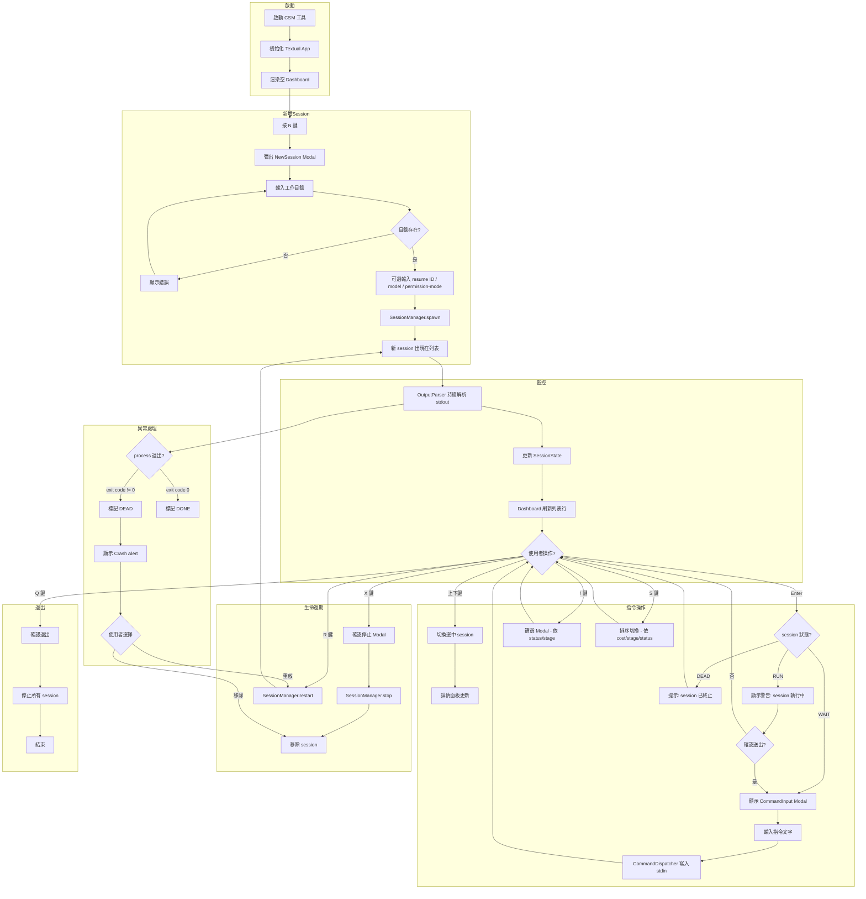
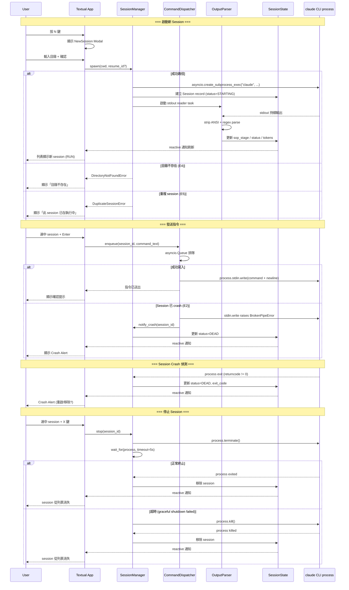

# Spec Converge Review — Round 2 Input

## Review Standards

> 以下為審查標準（來源：.claude/references/review-standards.md）

### Spec Review 審查項目

#### 1. 完整性
- 每個任務都有可測試的 DoD
- 驗收標準使用 Given-When-Then，覆蓋 happy + error path
- 任務依賴關係清楚、粒度合理
- 涵蓋所有 S0 成功標準
- 技術決策有理由、有替代方案考量

#### 2. 技術合規
- Data Flow 遵循專案既有的分層架構
- 各層職責清晰，不越界
- 命名與既有 codebase 風格一致

#### 3. Codebase 一致性
- 提到的 class/method/endpoint 名稱存在或明確標為新建
- 未違反已知架構約束

#### 4. 風險與影響
- 影響範圍（impact_scope）完整列出
- 回歸風險、相依關係已評估

#### 5. S0 成功標準對照
- 每條成功標準可追溯到任務/驗收標準

### 嚴重度判定

| 等級 | 定義 |
|------|------|
| P0 | 阻斷：安全漏洞、資料遺失、架構根本錯誤、需求理解偏差 |
| P1 | 重要：邏輯錯誤、缺驗證、效能瓶頸、不符規範、DoD 不可測試 |
| P2 | 建議：命名風格、註解品質、可讀性、最佳實踐 |

---

## Output Format

> 以下為輸出格式（來源：.claude/references/review-convergence-output-schema.md）

收斂模式 Schema：
- decision 使用 `APPROVED | REJECTED`
- APPROVED 條件：P0=0 且 P1=0 且 P2=0（有任何 finding 就是 REJECTED）

每個 finding 格式：
```
### [SR-Px-NNN] Px - 問題標題

- id: `SR-Px-NNN`
- severity: `P0 | P1 | P2`
- category: `architecture | logic | security | test | completeness | consistency | performance`
- file: `path/to/file` or `spec section`
- line: N/A
- rule: 違反的規則/標準
- evidence: 具體觀察到的事實
- impact: 風險與影響範圍
- fix: 可執行修復建議
```

Summary 格式：
```
## Summary

- totals: `P0=N, P1=N, P2=N`
- decision: `APPROVED | REJECTED`
```

---

## 待審查 Spec（spec-current.md）

# S1 Dev Spec: Claude Session Manager (CSM)

> **階段**: S1 技術分析
> **建立時間**: 2026-03-15 01:00
> **Agent**: codebase-explorer (Phase 1) + architect (Phase 2/3)
> **工作類型**: new_feature
> **複雜度**: L

---

## 1. 概述

### 1.1 需求參照
> 完整需求見 `s0_brief_spec.md`，以下僅摘要。

開發一個 Python TUI 工具（基於 Textual），用來批量啟動、監控和操控 10+ 個 Claude Code terminal session，在一個畫面內即時掌握所有 session 的 SOP 階段、執行狀態、token 成本，並可直接從 dashboard 對任意 session 發送指令。

### 1.2 技術方案摘要

本專案為 greenfield Python 應用，採用 `src/csm/` layout。核心架構分三層：

1. **TUI Layer**（Textual App）：Dashboard 主畫面含 session 列表、詳情面板、狀態列、Modal 對話框，透過 Textual reactive 機制刷新 UI。
2. **Core Layer**（asyncio）：SessionManager 管理 subprocess 生命週期、OutputParser 以正則 + 狀態機解析 stdout、CommandDispatcher 透過 asyncio.Queue + stdin.write 派送指令。
3. **State Layer**（in-memory）：Session dataclass 儲存結構化狀態、CostAggregator 彙總成本。

所有 Claude Code session 透過 `asyncio.create_subprocess_exec` 啟動互動式 subprocess（stdin/stdout/stderr PIPE），每個 session 對應一個 asyncio Task 持續讀取 stdout 並餵給 OutputParser。

**關鍵限制**：`--output-format stream-json` 僅在 `--print`（單次問答）模式下可用，互動式多輪 session 必須解析原始終端輸出。因此 OutputParser 的解析規則需要 Wave 0 驗證 claude CLI 在 PIPE 模式下的實際輸出格式。

---

## 2. 影響範圍（Phase 1：codebase-explorer）

### 2.1 受影響檔案

> Greenfield 專案，以下全部為新增。

#### TUI (Textual Widgets)
| 檔案 | 變更類型 | 說明 |
|------|---------|------|
| `src/csm/app.py` | 新增 | Textual App 主入口、佈局、全域快捷鍵 |
| `src/csm/widgets/session_list.py` | 新增 | Session 列表 DataTable widget |
| `src/csm/widgets/detail_panel.py` | 新增 | 選中 session 的輸出摘要面板 |
| `src/csm/widgets/modals.py` | 新增 | NewSession / ConfirmStop / CommandInput Modal |

#### Core (Python asyncio)
| 檔案 | 變更類型 | 說明 |
|------|---------|------|
| `src/csm/__init__.py` | 新增 | Package init + version |
| `src/csm/core/session_manager.py` | 新增 | Session 生命週期管理（spawn/kill/restart） |
| `src/csm/core/output_parser.py` | 新增 | stdout 解析器（SOP 階段、token、狀態） |
| `src/csm/core/command_dispatcher.py` | 新增 | 指令佇列與 stdin 寫入 |
| `src/csm/models/session.py` | 新增 | Session 資料模型 |
| `src/csm/models/cost.py` | 新增 | 成本追蹤模型 |
| `src/csm/utils/ansi.py` | 新增 | ANSI escape sequence 清除 |
| `src/csm/utils/ring_buffer.py` | 新增 | 環形緩衝區 |

#### 專案設定
| 檔案 | 變更類型 | 說明 |
|------|---------|------|
| `pyproject.toml` | 新增 | 專案元資料、依賴宣告、entrypoint |
| `src/csm/styles/app.tcss` | 新增 | Textual CSS 樣式定義 |

#### Database
無資料庫。

### 2.2 依賴關係
- **上游依賴**: claude CLI（必須已安裝且在 PATH）、Python 3.10+、Textual >= 0.80
- **下游影響**: 無（獨立工具）

### 2.3 現有模式與技術考量

Greenfield 專案，無既有 codebase 模式需遵循。以下為本專案建立的慣例：

- **async-first**：所有 I/O 操作走 asyncio，不阻塞 Textual 事件迴圈
- **dataclass 為主**：Session/Cost 模型用 `@dataclass`，輕量且型別安全
- **Textual reactive**：UI 狀態變更透過 Textual 的 `reactive` 屬性驅動渲染
- **subprocess 管理**：統一使用 `asyncio.create_subprocess_exec`，永不用 `shell=True`

---

## 3. User Flow（Phase 2：architect）



### 3.1 主要流程

| 步驟 | 用戶動作 | 系統回應 | 備註 |
|------|---------|---------|------|
| 1 | 執行 `csm` 或 `python -m csm` | 啟動 Textual App，顯示空 Dashboard | entrypoint 定義在 pyproject.toml |
| 2 | 按 `N` | 彈出 NewSession Modal | 焦點自動移到工作目錄輸入框 |
| 3 | 輸入工作目錄、可選 resume ID | 驗證目錄存在性、檢查重複 session | 路徑支援 Tab 補全（Textual Input） |
| 4 | 確認送出 | SessionManager spawn claude process | 列表新增一行，狀態為 RUN |
| 5 | 上下鍵瀏覽 | 詳情面板顯示選中 session 的最近輸出 | ring buffer 最近 100 行 |
| 6 | 按 `Enter` | 依 session 狀態：WAIT→直接輸入框、RUN→警告確認後輸入、DEAD→提示已終止 | 防誤操作 |
| 7 | 輸入指令文字、送出 | CommandDispatcher 寫入 stdin | 顯示「指令已送出」提示 |
| 8 | 按 `X` | 彈出確認停止 Modal | 需二次確認 |
| 9 | 按 `Q` | 停止所有 session、退出工具 | 優雅關機 |

### 3.2 異常流程

> 每個例外情境引用 S0 的 E{N} 編號，確保追溯。

| S0 ID | 情境 | 觸發條件 | 系統處理 | 用戶看到 |
|-------|------|---------|---------|---------|
| E1 | 快速連續發送多指令 | 1 秒內多次 Enter 送出 | FIFO asyncio.Queue 逐一寫入 stdin | 指令按順序送出，不丟棄 |
| E2 | 送指令時 session crash | stdin.write 時 process 已終止 | 捕捉 BrokenPipeError，標記 DEAD | 「Session #N 已終止」Alert |
| E3 | 輸出爆量 | stdout 每秒 >100KB | ring buffer 截斷，只保留最近 1000 行 | 詳情面板顯示最近輸出，不卡頓 |
| E4 | 路徑含空白/特殊字元 | 輸入含空格路徑 | subprocess 參數用 list（不用 shell=True） | 正常啟動 session |
| E5 | 重複啟動同 session | 同目錄同 resume ID 已在跑 | 阻擋並顯示提示 | 「此 session 已在執行中」Alert |
| E6 | 系統資源緊繃 | CPU >90% / RAM >80% 持續 30 秒 | 狀態列顯示警告 | 「系統負載過高」警告 + 建議 |

### 3.3 S0→S1 例外追溯表

| S0 ID | 維度 | S0 描述 | S1 處理位置 | 覆蓋狀態 |
|-------|------|---------|-----------|---------|
| E1 | 並行/競爭 | 快速連續對同一 session 發送多個指令 | `core/command_dispatcher.py` — asyncio.Queue FIFO | ✅ 覆蓋 |
| E2 | 狀態轉換 | Session 在送指令的瞬間 crash | `core/command_dispatcher.py` — try/except BrokenPipeError + `core/session_manager.py` — process exit callback | ✅ 覆蓋 |
| E3 | 資料邊界 | Session 輸出極大量文字 | `utils/ring_buffer.py` — 固定容量 circular buffer（1000 行） | ✅ 覆蓋 |
| E4 | 資料邊界 | 工作目錄路徑含空白或特殊字元 | `core/session_manager.py` — create_subprocess_exec 用 list args | ✅ 覆蓋 |
| E5 | 業務邏輯 | 重複啟動同目錄同 resume ID 的 session | `core/session_manager.py` — spawn 前查重 | ✅ 覆蓋 |
| E6 | 系統資源 | 10+ session 同時跑導致資源緊繃 | `app.py` — 定期檢查 psutil（若可用）或 session 數量上限 + 狀態列警告 | ⚠️ 部分覆蓋（psutil 為可選依賴，降級為 session 數量警告） |

---

## 4. Data Flow



### 4.1 內部介面契約

> 本專案無 HTTP API（純本地 TUI 工具）。以下定義 Core Layer 的 Python 介面。

**SessionManager**

```python
class SessionManager:
    async def spawn(self, cwd: str, resume_id: str | None = None,
                    model: str | None = None,
                    permission_mode: str = "auto") -> str:
        """啟動新 claude CLI session。回傳 session_id。
        Raises: DirectoryNotFoundError, DuplicateSessionError"""

    async def stop(self, session_id: str) -> None:
        """停止 session。先 terminate，5 秒超時後 kill。"""

    async def restart(self, session_id: str) -> str:
        """以原參數重啟 session。回傳新 session_id。"""

    def get_sessions(self) -> list[SessionState]:
        """回傳所有 session 狀態。"""
```

**CommandDispatcher**

```python
class CommandDispatcher:
    async def enqueue(self, session_id: str, command: str) -> None:
        """將指令加入 session 的 FIFO 佇列。
        Raises: SessionNotFoundError, SessionDeadError, QueueFullError"""
```

**OutputParser**

```python
class OutputParser:
    def parse_line(self, raw_line: str) -> ParsedEvent | None:
        """解析一行 stdout 輸出。
        回傳 ParsedEvent (sop_stage_change | token_update | status_change | plain_text)
        或 None（無法辨識的行）。"""
```

### 4.2 資料模型

```python
@dataclass
class SessionState:
    session_id: str              # UUID4
    cwd: str                     # 工作目錄絕對路徑
    resume_id: str | None        # Claude CLI session ID（用於 --resume）
    model: str | None            # 指定模型（sonnet/opus）
    permission_mode: str         # auto / default / plan
    status: SessionStatus        # STARTING / RUN / WAIT / DONE / DEAD
    sop_stage: str | None        # S0-S7 或 None
    exit_code: int | None        # process exit code
    pid: int | None              # OS process ID
    started_at: datetime
    last_activity: datetime      # 最後一次 stdout 輸出時間
    tokens_in: int               # 累計 input tokens
    tokens_out: int              # 累計 output tokens
    cost_usd: float              # 累計成本（美元）— 單一事實來源
    # 注意: output_buffer (RingBuffer) 由 OutputBufferStore 獨立管理，不嵌入 SessionState
    # 這保持 SessionState 為純資料 dataclass（可序列化、可 hash）
    # 成本資料流向: OutputParser 解析 token → SessionState 更新 → CostAggregator.update() 同步
    # SessionState 是個別成本的事實來源，CostAggregator 只做彙總（讀取 SessionState 後寫入自身快取）
    # TUI 列表讀 SessionState.cost_usd，狀態列讀 CostAggregator.get_total()

class OutputBufferStore:
    """獨立管理每個 session 的輸出緩衝區。"""
    _buffers: dict[str, RingBuffer]  # session_id → RingBuffer
    def get(self, session_id: str) -> RingBuffer: ...
    def create(self, session_id: str, capacity: int = 1000) -> RingBuffer: ...
    def remove(self, session_id: str) -> None: ...

class SessionStatus(Enum):
    STARTING = "STARTING"
    RUN = "RUN"
    WAIT = "WAIT"
    DONE = "DONE"
    DEAD = "DEAD"

@dataclass
class ParsedEvent:
    event_type: str              # sop_stage | token_update | status_change | text
    data: dict                   # 事件資料（依 event_type 不同）

@dataclass
class CostSummary:
    total_tokens_in: int = 0
    total_tokens_out: int = 0
    total_cost_usd: float = 0.0
    session_count: int = 0

class RingBuffer:
    """固定容量環形緩衝區，儲存最近 N 行文字。"""
    def __init__(self, capacity: int = 1000): ...
    def append(self, line: str) -> None: ...
    def get_lines(self, n: int | None = None) -> list[str]: ...
    def clear(self) -> None: ...
```

---

## 5. 任務清單

### 5.1 任務總覽

| # | 任務 | FA | 類型 | 複雜度 | Agent | 依賴 |
|---|------|-----|------|--------|-------|------|
| 0 | 專案腳手架 | 全域 | 基礎建設 | S | python-expert | - |
| 1 | Wave 0: Claude CLI PIPE 模式驗證 | FA-D | 探索驗證 | M | python-expert | #0 |
| 2 | RingBuffer 實作 | FA-D | 工具庫 | S | python-expert | #0 |
| 3 | ANSI escape 清除工具 | FA-D | 工具庫 | S | python-expert | #0 |
| 4 | Session 資料模型 | FA-A | 資料層 | S | python-expert | #0 |
| 5 | Cost 追蹤模型 | FA-B | 資料層 | S | python-expert | #4 |
| 6 | OutputParser 實作 | FA-D | 核心邏輯 | L | python-expert | #1, #2, #3 |
| 7 | SessionManager 實作 | FA-A | 核心邏輯 | L | python-expert | #4, #6 |
| 8 | CommandDispatcher 實作 | FA-C | 核心邏輯 | M | python-expert | #7 |
| 9 | Session 列表 Widget | FA-B | TUI | M | python-expert | #4 |
| 10 | 詳情面板 Widget | FA-B | TUI | M | python-expert | #2 |
| 11 | Modal 對話框 | FA-B/A/C | TUI | M | python-expert | #9 |
| 12 | Textual App 主入口 + 佈局 | FA-B | TUI | L | python-expert | #7, #8, #9, #10, #11 |
| 13 | 整合測試 + 手動測試計畫 | 全域 | 測試 | M | python-expert | #12 |

### 5.2 任務詳情

#### Task #0: 專案腳手架
- **類型**: 基礎建設
- **描述**: 建立 `pyproject.toml`（專案名稱 `csm`、依賴 textual >= 0.80、Python >= 3.10）、`src/csm/` 目錄結構、`__init__.py`、`__main__.py` 入口、`.gitignore`。定義 `[project.scripts]` entrypoint `csm = "csm.app:main"`。
- **DoD**:
  - [ ] `pyproject.toml` 包含正確的 metadata、dependencies、entrypoint
  - [ ] `src/csm/` 目錄結構完整（core/, models/, widgets/, utils/ 子目錄含 `__init__.py`）
  - [ ] `pip install -e .` 成功
  - [ ] `python -m csm` 可執行（即使只顯示空畫面）
  - [ ] pyproject.toml 包含 pytest 為 dev dependency，`python -m pytest` 可在專案根目錄執行
- **驗收方式**: `pip install -e ".[dev]"` + `csm` 指令可啟動 + `python -m pytest` 可執行

#### Task #1: Wave 0 — Claude CLI PIPE 模式驗證
- **描述**: 撰寫一個獨立腳本 `scripts/cli_pipe_test.py`，驗證 claude CLI 的 6 項行為。將測試結果記錄在 `docs/wave0_cli_findings.md`。
- **決策閘門（GO/NO-GO）**:
  - **GO 條件**: claude CLI 在 PIPE 模式下能正常啟動、stdout 輸出可讀文字、stdin.write 能成功送出指令並收到回應
  - **NO-GO 條件**: claude CLI 偵測 isatty() 而拒絕運作、stdout 只輸出亂碼、或完全無輸出
  - **NO-GO 時處理**: 回到 S1 重新設計。備案架構：(1) 使用 `winpty` 模擬 PTY；(2) 使用 `pexpect` 的 `popen_spawn`；(3) 改為全部使用 `--print --output-format stream-json` 模式
- **DoD**:
  - [ ] 腳本可執行並成功 spawn claude CLI
  - [ ] 6 個驗證項目都有明確結論（含輸出截圖/樣本）
  - [ ] 產出 `docs/wave0_cli_findings.md` 文件
  - [ ] GO/NO-GO 決策明確記錄
  - [ ] 若 NO-GO，提出替代方案並評估可行性

#### Task #6: OutputParser 實作
- **依賴**: Task #1（Wave 0 結果決定解析策略）, #2, #3
- **描述**: 實作 `src/csm/core/output_parser.py`。**初版解析規則（待 Wave 0 修正）**：
  - **SOP 階段**: 正則匹配 `S[0-7]` 或 `Launching skill: s[0-7]` 等關鍵字
  - **Token 用量**: 匹配 `Token usage:` 或 `total_cost` 等模式
  - **Session 狀態判定**：由 SessionManager 的 stdout reader task 負責（非 OutputParser）。OutputParser 只解析單行內容，不做計時。SessionManager 在最後一次 stdout 輸出後 5 秒無新輸出時，將 session 標記為 WAIT。
  - 每行先經過 `strip_ansi`，再餵給 regex 匹配，結果封裝為 `ParsedEvent`
- **DoD**:
  - [ ] `OutputParser.parse_line` 實作完成
  - [ ] 狀態機正確追蹤 SOP 階段轉換
  - [ ] 單元測試使用 Wave 0 捕獲的真實輸出樣本（若 Wave 0 為 NO-GO，改用備案架構的 stream-json 模擬輸出作為測試基準）
  - [ ] 對無法辨識的行回傳 plain_text 事件（不丟棄）
- **驗收方式**: 用 Wave 0 樣本資料（或備案樣本）通過單元測試

#### Task #7: SessionManager 實作
- **依賴**: Task #4, #6（介面定義即可，不需 #6 完整實作；可先用 stub OutputParser 並行開發）
- **描述**: 實作 `src/csm/core/session_manager.py`。核心職責：spawn、stop、restart、crash detection、Windows 相容。
  - **WAIT 狀態判定**：stdout reader task 在最後一次收到 stdout 輸出後，若 5 秒無新輸出，則將 session 標記為 WAIT。
- **DoD**:
  - [ ] spawn / stop / restart 三個方法實作完成
  - [ ] crash detection 正確觸發
  - [ ] E4（特殊字元路徑）、E5（重複 session）正確處理
  - [ ] stdout reader task 正確啟動和清理
  - [ ] Windows 環境下 terminate 行為正確
  - [ ] 自動化測試（mock subprocess）覆蓋：spawn 成功路徑、DirectoryNotFoundError、DuplicateSessionError、stop terminate→timeout→kill 路徑、crash detection 觸發 DEAD

#### Task #3: ANSI escape 清除工具
- **描述**: 實作 `src/csm/utils/ansi.py`。提供 `strip_ansi(text: str) -> str` 函式。
- **DoD**:
  - [ ] `strip_ansi` 函式實作完成
  - [ ] 處理 CR 覆寫：`"hello\rworld"` → `"world"`
  - [ ] 單元測試覆蓋至少 3 種 ANSI pattern：SGR 顏色 (`\x1b[31m`)、CSI cursor move (`\x1b[2J`)、OSC title set (`\x1b]0;title\x07`)

#### Task #5: Cost 追蹤模型
- **描述**: 實作 `src/csm/models/cost.py`。`CostAggregator` 彙總所有 session 的 token 用量和成本。
- **DoD**:
  - [ ] `CostAggregator` class 實作完成
  - [ ] `get_total()` 回傳所有 session 的總計 tokens_in/out、cost_usd
  - [ ] 支援移除 session 時清除其成本記錄
  - [ ] 單元測試覆蓋：多 session 累加後 get_total() 正確、session 移除後成本扣除、空白狀態回傳 0

#### Task #8: CommandDispatcher 實作
- **描述**: 每個 session 對應一個 `asyncio.Queue(maxsize=50)`（bounded），consumer task 從 queue 取指令並寫入 stdin。
- **DoD**:
  - [ ] `enqueue` 方法正確加入佇列；queue 滿時 raise QueueFullError
  - [ ] consumer task 逐一寫入 stdin
  - [ ] BrokenPipeError 正確捕捉並觸發 crash 流程
  - [ ] session stop/restart 時 consumer task 正確清理，Queue 清空

#### Task #12: Textual App 主入口 + 佈局
- **描述**: 實作 `src/csm/app.py`。
- **DoD**:
  - [ ] 佈局正確（列表+詳情+狀態列）
  - [ ] 所有快捷鍵正確觸發對應操作（含 `/` 篩選和 `S` 排序）
  - [ ] Enter 鍵依 session 狀態正確分支（WAIT/RUN/DEAD）
  - [ ] SessionManager 正確整合
  - [ ] 退出時所有 session 正確停止
  - [ ] 狀態列即時更新總成本
  - [ ] SESSION_LIMIT 超過時顯示警告（E6）

---

## 6. 技術決策（摘要）

- 套件管理：pip + pyproject.toml
- 事件迴圈：asyncio
- Subprocess 啟動：asyncio.create_subprocess_exec（list args，永不用 shell=True）
- 狀態管理：dataclass
- 指令佇列：asyncio.Queue(maxsize=50)
- 輸出緩衝：deque(maxlen) 封裝為 RingBuffer

---

## 7. 驗收標準

| # | 場景 | Given | When | Then | 優先級 |
|---|------|-------|------|------|--------|
| AC-1 | 啟動新 session | CSM 工具已啟動 | 按 N → 輸入有效工作目錄 → 確認 | 新 session 出現在列表，狀態為 RUN | P0 |
| AC-2 | 停止 session | 有至少一個 RUN 狀態的 session | 選中 session → 按 X → 確認 | session 從列表消失，claude CLI process 已終止 | P0 |
| AC-3 | 重啟 session | 有 DEAD 狀態的 session | 選中 DEAD session → 按 R | session 狀態變為 RUN，新 process 已啟動 | P0 |
| AC-4 | Dashboard 狀態顯示 | 有 3+ 個 session 在不同狀態 | 觀察 Dashboard 列表 | 各 session 正確顯示 SOP 階段、狀態指示符、成本 | P0 |
| AC-5 | 發送指令 | 有一個 WAIT 狀態的 session | 選中 → Enter → 輸入 "hello" → 送出 | 指令送入 session 的 stdin，session 開始回應 | P0 |
| AC-8 | Crash 偵測 | 有一個執行中的 session | 手動 kill 該 session 的 claude process | session 狀態變為 DEAD，顯示 Crash Alert | P0 |

---

## 前輪審查歷史

### Round 1 審查結果

> engine: fallback (codex 401 Unauthorized)
> P0=0, P1=5, P2=3
> decision: REJECTED

Finding 摘要（Round 1）：
- SR-P1-001: OutputParser WAIT 狀態判定依賴計時器，但 parse_line 為同步函式，無法偵測「超時無輸出」
- SR-P1-002: Task #6 DoD 要求「使用 Wave 0 真實樣本」，但 Wave 0 NO-GO 時 Task #6 的替代 DoD 未定義
- SR-P1-003: CommandDispatcher queue 滿時行為對 TUI 的影響未定義；4.1 介面契約未包含 QueueFullError
- SR-P1-004: SessionState 與 CostAggregator 間的成本資料同步機制未定義
- SR-P1-005: Task #7 依賴 Task #6（L 複雜度），Wave 0 延誤時無緩解措施
- SR-P2-001: Task #3 ANSI 正則覆蓋範圍不具體，「擴展覆蓋 OSC」是模糊描述
- SR-P2-002: CostSummary 在整個 spec 中無定義
- SR-P2-003: Task #0 DoD 未列出 pytest dev dependency

### Round 1 修正摘要

- SR-P1-001: WAIT 判定改由 SessionManager 負責，定義 5 秒超時
- SR-P1-002: Wave 0 NO-GO 時 Task #6 備案 DoD（改用 stream-json 模擬輸出）
- SR-P1-003: 介面契約補充 QueueFullError
- SR-P1-004: 明確成本資料流向（SessionState→CostAggregator）
- SR-P1-005: Task #7 可用 stub OutputParser 並行開發
- SR-P2-001: ANSI DoD 列舉 3 種具體 pattern
- SR-P2-002: 補充 CostSummary dataclass 定義
- SR-P2-003: Task #0 補充 pytest dev dependency

---

## 審查指示

你是資深 Python 架構審查員，正在執行 Spec Converge Round 2 審查。

收斂模式規則：
1. 對照 Round 1 修正摘要，驗證每個修正是否確實反映在 spec-current.md 中
2. 若前輪 finding 已被修正，不要重複提出
3. 若前輪 finding 修正不完整或有殘留問題，可提出新 finding
4. 嚴格審查是否有 spec-current.md 中的新問題或前輪未發現的問題
5. 每個 finding 必須有具體 evidence（引用 spec 原文或段落）
6. APPROVED 條件：P0=0 且 P1=0 且 P2=0

請依照 Output Format schema 輸出審查結果。
