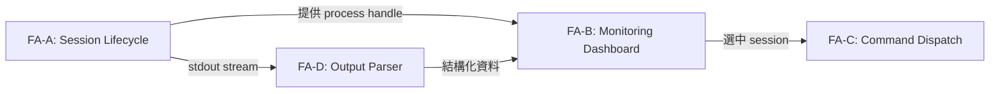
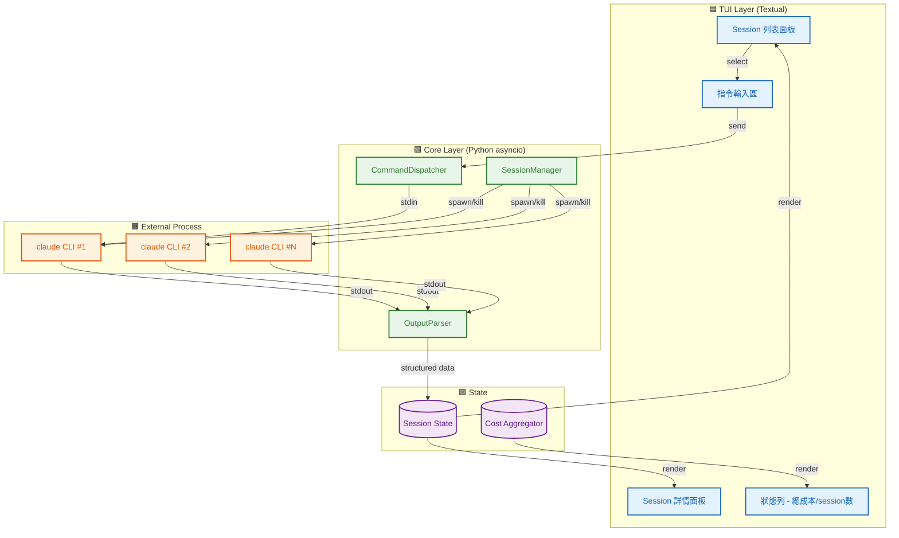
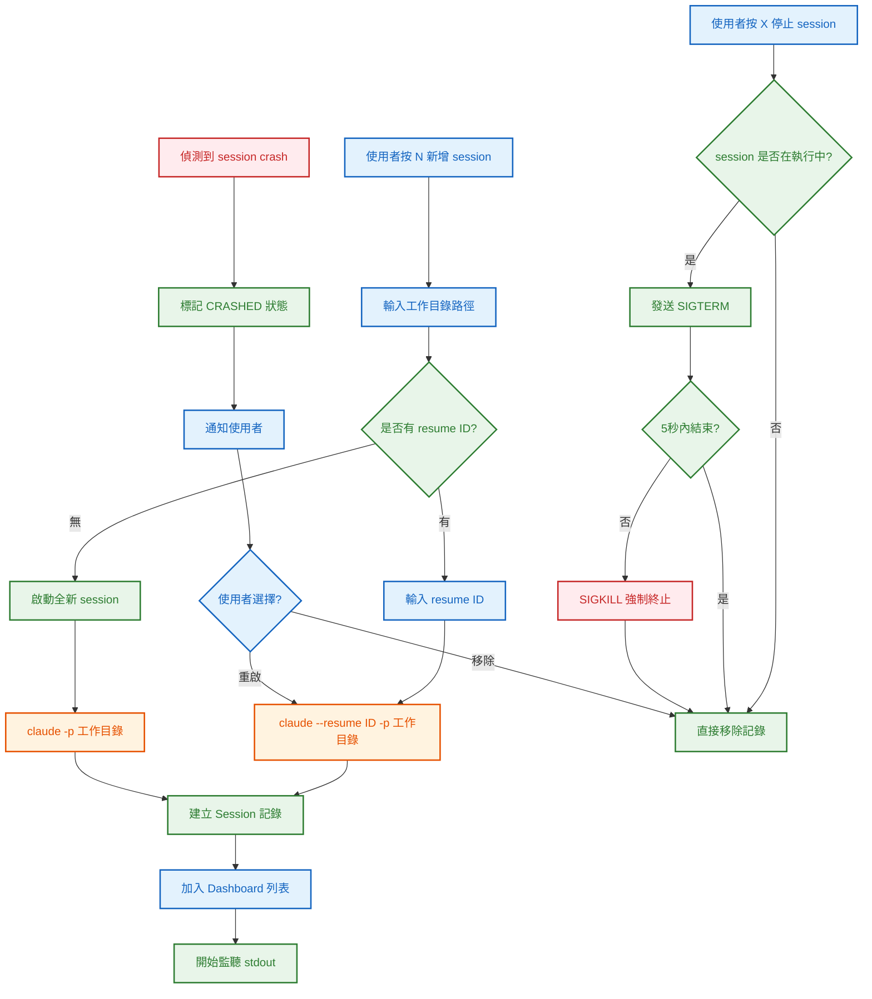
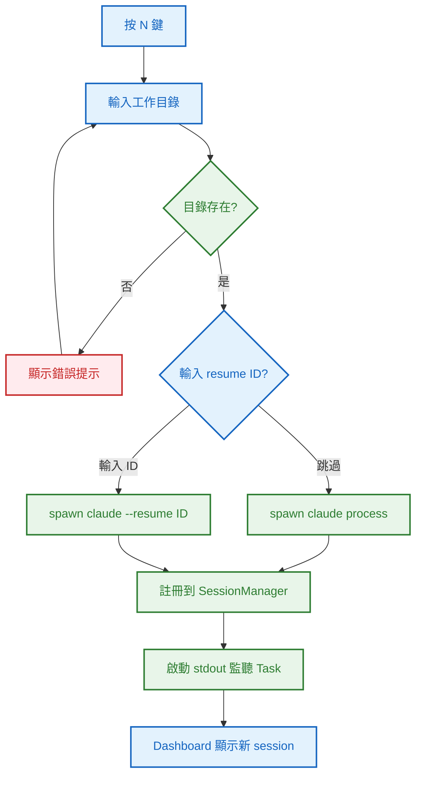
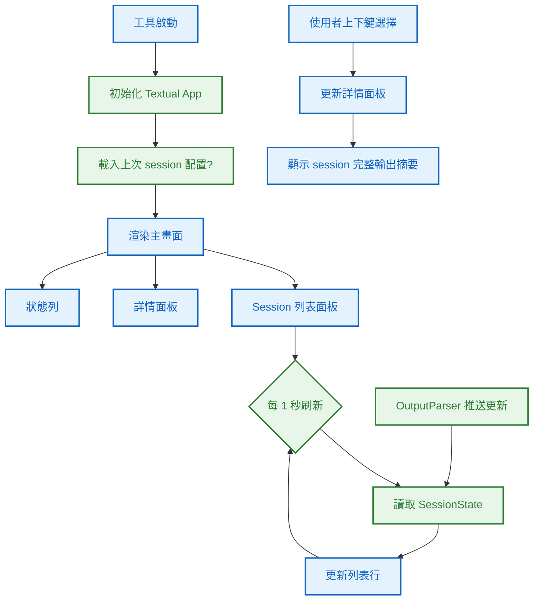
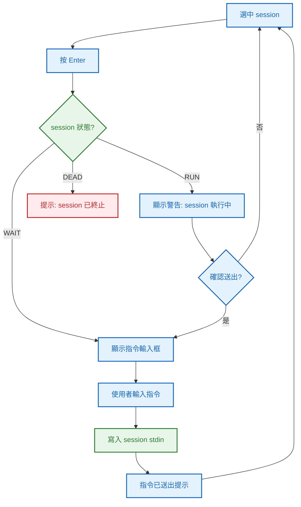
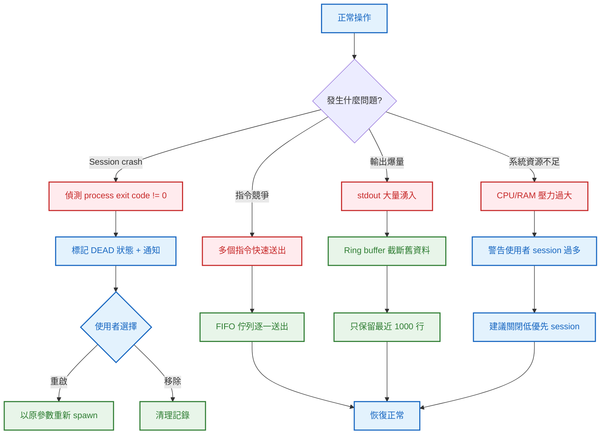

# S0 Brief Spec: Claude Session Manager (CSM)

> **階段**: S0 需求討論
> **建立時間**: 2026-03-15 00:00
> **Agent**: requirement-analyst
> **Spec Mode**: Full Spec
> **工作類型**: new_feature

---

## 0. 工作類型

**本次工作類型**：`new_feature`

## 1. 一句話描述

開發一個 Python TUI 工具（類似 htop/lazygit），用來批量啟動、監控和操控 10+ 個 Claude Code terminal session。

## 2. 為什麼要做

### 2.1 痛點

- **視窗切換地獄**：同時跑 10+ 個 Claude Code session，每個在獨立終端視窗，需要不斷 alt-tab 切換查看進度，認知負擔極高。
- **狀態不可見**：無法一眼掌握哪些 session 在等你回覆（阻塞中）、哪些在自動執行（SOP autopilot），導致回應延遲。
- **成本失控**：Token 用量分散在各 session 輸出中，無法即時掌握總成本，可能不知不覺超支。
- **操作效率低**：要對某個 session 下指令，得先找到那個視窗、切過去、打字、再切回來。

### 2.2 目標

- 一個畫面看完所有 session 狀態（SOP 階段、等待/執行中、token 成本）
- 能從 dashboard 直接對任意 session 發送指令
- 能從 dashboard 啟動新的 Claude Code session（指定工作目錄、resume ID）
- Session crash 時自動偵測並提供重啟選項

## 3. 使用者

| 角色 | 說明 |
|------|------|
| 開發者 (DEX) | 同時管理多個 Claude Code session 進行並行開發，需要統一監控與操作介面 |

## 4. 核心流程

> **閱讀順序**：功能區拆解（理解全貌）→ 系統架構總覽（理解組成）→ 各功能區流程圖（對焦細節）→ 例外處理（邊界情境）

> 圖例：🟦 藍色 = TUI 介面　｜　🟩 綠色 = 程序管理層　｜　🟧 橘色 = Claude Code CLI　｜　🟪 紫色 = 狀態儲存　｜　🟥 紅色 = 例外/錯誤

### 4.0 功能區拆解（Functional Area Decomposition）

#### 功能區識別表

| FA ID | 功能區名稱 | 一句話描述 | 入口 | 獨立性 |
|-------|-----------|-----------|------|--------|
| FA-A | Session Lifecycle | 啟動、停止、重啟 Claude Code session | Dashboard 主畫面 New Session 操作 | 高 |
| FA-B | Monitoring Dashboard | 即時顯示所有 session 狀態（SOP 階段、等待/執行、token、摘要） | 工具啟動自動進入 | 高 |
| FA-C | Command Dispatch | 從 dashboard 選取 session 並發送指令 | Dashboard 選中 session 後 | 中 |
| FA-D | Output Parser | 解析 Claude Code 輸出，提取 SOP 階段、token 用量、狀態等結構化資訊 | 被 FA-B 內部呼叫 | 低 |

#### 拆解策略

**本次策略**：`single_sop_fa_labeled`

FA-D 是 FA-B 的內部依賴，不獨立存在。4 個 FA 中 3 個有中高獨立性，但整體耦合度不低（FA-B 依賴 FA-A 的程序、FA-C 依賴 FA-B 的選擇），適合單 SOP + FA 標籤。

#### 跨功能區依賴



| 來源 FA | 目標 FA | 依賴類型 | 說明 |
|---------|---------|---------|------|
| FA-A | FA-B | 資料共用 | Session 程序的 handle、狀態供 dashboard 顯示 |
| FA-A | FA-D | 資料共用 | Session 的 stdout stream 供 parser 解析 |
| FA-D | FA-B | 資料共用 | 解析後的結構化資料（SOP 階段、token）供 dashboard |
| FA-B | FA-C | UI 導航 | 使用者在 dashboard 選中 session 後進入指令模式 |

---

### 4.1 系統架構總覽



**架構重點**：

| 層級 | 組件 | 職責 |
|------|------|------|
| **TUI** | Textual App | 畫面渲染、鍵盤事件、佈局管理 |
| **Core** | SessionManager | 管理所有 Claude Code subprocess 的生命週期 |
| **Core** | OutputParser | 即時解析 stdout，提取 SOP stage、token、status |
| **Core** | CommandDispatcher | 將使用者指令寫入指定 session 的 stdin |
| **External** | claude CLI | 實際的 Claude Code 程序（每個 session 一個 process） |
| **State** | Session State | 每個 session 的結構化狀態（in-memory） |
| **State** | Cost Aggregator | 彙總所有 session 的 token 用量和成本 |

---

### 4.2 FA-A: Session Lifecycle

> 本節涵蓋啟動、停止、重啟 Claude Code session 的完整流程。

#### 4.2.1 全局流程圖



**技術細節補充**：
- 使用 `asyncio.create_subprocess_exec` spawn Claude Code 程序
- stdin/stdout/stderr 均 pipe，由 Core Layer 管理
- 每個 session 獨立 asyncio Task 負責讀取 stdout

---

#### 4.2.2 啟動新 Session（局部）



---

#### 4.2.3 Happy Path 摘要

| 路徑 | 入口 | 結果 |
|------|------|------|
| **A：新增 session** | 按 N → 輸入目錄 → (可選 resume ID) | 新 Claude Code 程序啟動，出現在 Dashboard |
| **B：停止 session** | 選中 session → 按 X | 程序優雅終止，從列表移除 |
| **C：crash 重啟** | 系統偵測 crash → 使用者選重啟 | 程序以相同參數重新啟動 |

---

### 4.3 FA-B: Monitoring Dashboard

> 本節涵蓋 TUI 主畫面的資訊呈現與互動。

#### 4.3.1 全局流程圖



#### 4.3.2 Dashboard 佈局設計

```
┌──────────────────────────────────────────────────────────────────┐
│  Claude Session Manager v1.0         Total: $12.34  Sessions: 8 │
├──────────────────────────────────────┬───────────────────────────┤
│ # │ Dir        │ Stage │ Status │ $  │ Recent Output             │
│───┼────────────┼───────┼────────┼────│                           │
│ 1 │ project-a  │  S4   │ ▶ RUN  │2.1 │ [S4] Implementing wave 1  │
│ 2 │ project-b  │  S0   │ ⏸ WAIT │0.3 │ 等待確認需求...           │
│ 3 │ project-c  │  S6   │ ▶ RUN  │4.2 │ Running test suite...     │
│ 4 │ project-d  │  --   │ ▶ RUN  │1.0 │ Searching codebase...     │
│ 5 │ project-e  │  S7   │ ✅ DONE│3.4 │ Commit created.           │
│ 6 │ project-f  │  S4   │ 💀 DEAD│0.8 │ [CRASHED] Exit code 1     │
│   │            │       │        │    │                           │
│   │            │       │        │    │                           │
├──────────────────────────────────────┤                           │
│ [N]ew [X]Kill [R]estart [Enter]Cmd  │                           │
│ [/]Filter [S]ort [Q]uit             │                           │
└──────────────────────────────────────┴───────────────────────────┘
```

**列表欄位**：
- `#`: Session 編號
- `Dir`: 工作目錄（basename）
- `Stage`: SOP 階段（S0-S7 或 `--` 表示非 SOP 模式）
- `Status`: `▶ RUN`（自動執行中）、`⏸ WAIT`（等待使用者回覆）、`✅ DONE`（完成）、`💀 DEAD`（crash）
- `$`: 累計 token 成本（美元）
- 右側面板：選中 session 的最近輸出摘要

**快捷鍵**：
| 鍵 | 動作 |
|----|------|
| `N` | 新增 session |
| `X` | 停止選中 session |
| `R` | 重啟選中 session |
| `Enter` | 對選中 session 發送指令 |
| `/` | 篩選 session（依狀態/階段） |
| `S` | 排序（依成本/階段/狀態） |
| `Q` | 退出工具 |
| `↑/↓` | 選擇 session |
| `Tab` | 切換焦點（列表/詳情） |

---

#### 4.3.3 Happy Path 摘要

| 路徑 | 入口 | 結果 |
|------|------|------|
| **A：瀏覽總覽** | 啟動工具 | 看到所有 session 狀態列表 + 總成本 |
| **B：查看詳情** | 上下鍵選中 session | 右側面板顯示最近輸出摘要 |
| **C：篩選排序** | 按 / 或 S | 列表按條件篩選/排序 |

---

### 4.4 FA-C: Command Dispatch

> 本節涵蓋從 dashboard 對選中 session 發送指令。

#### 4.4.1 全局流程圖



**技術細節補充**：
- 指令寫入使用 `process.stdin.write()` + flush
- 佇列機制：快速連續發送多個指令時，加入 FIFO 佇列，逐一寫入，避免競爭

---

#### 4.4.2 Happy Path 摘要

| 路徑 | 入口 | 結果 |
|------|------|------|
| **A：對等待中的 session 送指令** | 選中 WAIT session → Enter → 輸入指令 | 指令送入 session，session 繼續執行 |
| **B：對執行中的 session 送指令** | 選中 RUN session → Enter → 確認 → 輸入 | 指令排入佇列，送入 session |

---

### 4.5 FA-D: Output Parser

> 本節涵蓋 Claude Code 輸出的即時解析邏輯。

#### 4.5.1 解析目標

| 資訊 | 解析策略 | 範例模式 |
|------|---------|---------|
| SOP 階段 | 正則匹配 `S[0-7]` 相關關鍵字 | `S0 需求討論`、`S4 實作`、`Launching skill: s4-implement` |
| Session 狀態 | 偵測是否在等待使用者輸入 | 游標閃爍 / 無輸出超過 N 秒 / 提示符號 |
| Token 用量 | 解析 Claude Code 的 cost 輸出 | `Token usage: 1234 input, 567 output` |
| 輸出摘要 | 保留最近 N 行有意義的輸出 | 過濾 ANSI escape codes，取最後 20 行 |

**技術細節**：
- 使用 ring buffer（固定大小 circular buffer）儲存最近輸出，避免記憶體無限增長
- ANSI escape sequence 需 strip 後再解析
- 解析在獨立 asyncio task 中進行，不阻塞 TUI 渲染

---

### 4.6 例外流程圖



### 4.7 六維度例外清單

| 維度 | ID | FA | 情境 | 觸發條件 | 預期行為 | 嚴重度 |
|------|-----|-----|------|---------|---------|--------|
| 並行/競爭 | E1 | FA-C | 快速連續對同一 session 發送多個指令 | 使用者在 1 秒內連按多次 Enter 送出 | FIFO 佇列逐一寫入 stdin，不丟棄 | P1 |
| 狀態轉換 | E2 | FA-A | Session 在送指令的瞬間 crash | process.stdin.write 時 process 已終止 | 捕捉 BrokenPipeError，標記 DEAD，通知使用者 | P1 |
| 資料邊界 | E3 | FA-D | Session 輸出極大量文字（例如 dump 大檔案） | stdout 每秒湧入 >100KB | Ring buffer 自動截斷，只保留最近 1000 行 | P1 |
| 資料邊界 | E4 | FA-B | 工作目錄路徑含空白或特殊字元 | 使用者輸入含空格的路徑 | 正確 quote 路徑，subprocess 參數用 list 不用 shell=True | P2 |
| 業務邏輯 | E5 | FA-A | 已有同目錄同 resume ID 的 session 在跑 | 使用者嘗試重複啟動 | 阻擋並提示「此 session 已在執行中」 | P1 |
| 系統資源 | E6 | 全域 | 10+ 個 session 同時執行導致系統資源緊繃 | CPU >90% 或 RAM >80% 持續 30 秒 | Dashboard 狀態列顯示警告，建議關閉低優先 session | P2 |

### 4.8 白話文摘要

這個工具讓你在一個終端畫面裡同時看到所有正在跑的 Claude Code session 的狀態，包括它們在做什麼階段、是不是在等你回覆、花了多少錢。你可以直接從這個畫面對任何一個 session 下指令，不用再到處切視窗。最壞的情況是某個 session 突然掛掉，工具會自動偵測到並讓你一鍵重啟。

## 5. 成功標準

| # | FA | 類別 | 標準 | 驗證方式 |
|---|-----|------|------|---------|
| 1 | FA-A | 功能 | 能從 TUI 啟動新的 Claude Code session（指定目錄 + 可選 resume ID） | 手動操作驗證 |
| 2 | FA-A | 功能 | 能停止/重啟選中的 session | 手動操作驗證 |
| 3 | FA-B | 功能 | Dashboard 正確顯示所有 session 的 SOP 階段、狀態、成本 | 啟動 3+ session 觀察顯示 |
| 4 | FA-B | 效能 | 列表刷新間隔 ≤1 秒，無明顯 UI 卡頓 | 10 個 session 同時跑時觀察 |
| 5 | FA-C | 功能 | 能從 dashboard 對選中 session 送指令，指令正確送達 | 送 "hello" 觀察 session 回應 |
| 6 | FA-D | 功能 | 正確解析 SOP 階段（S0-S7）和 token 用量 | 跑 autopilot session 觀察解析結果 |
| 7 | FA-A | 穩定性 | Session crash 時自動偵測並標記 DEAD 狀態 | 手動 kill Claude Code process 觀察 |

## 6. 範圍

### 範圍內
- **FA-A**: 啟動新 Claude Code session（指定目錄 + resume ID）
- **FA-A**: 停止、重啟 session
- **FA-A**: Session crash 偵測與重啟
- **FA-B**: Session 列表 + 狀態面板 + 總成本統計
- **FA-B**: 篩選/排序功能
- **FA-C**: 對選中 session 發送文字指令
- **FA-D**: 解析 SOP 階段、token 用量、session 狀態

### 範圍外
- Web dashboard（本次只做 TUI）
- Claude API 直接查詢用量（本次用輸出解析）
- Session 輸出的完整日誌儲存（本次只保留 ring buffer）
- 多用戶協作
- 跨機器遠端管理

## 7. 已知限制與約束

- 依賴 `claude` CLI 已安裝且在 PATH 中
- Windows 環境下 PTY 支援有限，可能需要使用 `subprocess.PIPE` 替代 `pty`
- Token 解析依賴 Claude Code 輸出格式，若格式變動需更新 parser
- Textual 框架在 Windows 上的某些終端模擬器中可能有渲染差異
- Python 3.10+ 為最低要求（asyncio 改進）

## 8. 前端 UI 畫面清單

> 本工具為 TUI，「畫面」指 Textual 的 Screen/Widget 組合。

### 8.1 FA-B: Dashboard 畫面

| # | 畫面 | 狀態 | 既有檔案 | 變更說明 |
|---|------|------|---------|---------|
| 1 | **主 Dashboard** | 新增 | — | Session 列表 + 詳情面板 + 狀態列的組合佈局 |
| 2 | **Session 列表** | 新增 | — | DataTable widget，顯示所有 session 狀態行 |
| 3 | **詳情面板** | 新增 | — | RichLog widget，顯示選中 session 的最近輸出 |
| 4 | **狀態列** | 新增 | — | Footer widget，顯示總成本、session 數、快捷鍵提示 |

### 8.2 FA-A: Session 管理畫面

| # | 畫面 | 狀態 | 既有檔案 | 變更說明 |
|---|------|------|---------|---------|
| 5 | **新增 Session Modal** | 新增 | — | 輸入工作目錄 + resume ID 的對話框 |
| 6 | **確認停止 Modal** | 新增 | — | 確認是否停止選中 session |

### 8.3 FA-C: 指令操作畫面

| # | 畫面 | 狀態 | 既有檔案 | 變更說明 |
|---|------|------|---------|---------|
| 7 | **指令輸入 Modal** | 新增 | — | 文字輸入框，送出指令到選中 session |

### 8.4 Alert / 彈窗清單

| # | Alert | FA | 狀態 | 觸發場景 | 內容摘要 |
|---|-------|-----|------|---------|---------|
| A1 | **Session Crashed** | FA-A | 新增 | Claude Code process 異常退出 | 「Session #N 已終止 (exit code X)。重啟 / 移除？」 |
| A2 | **資源警告** | 全域 | 新增 | 系統資源使用率過高 | 「系統負載過高，建議關閉部分 session」 |
| A3 | **重複 Session** | FA-A | 新增 | 嘗試啟動已存在的 session | 「此目錄已有執行中的 session」 |

### 8.5 畫面統計摘要

| 類別 | 數量 | 說明 |
|------|------|------|
| 新增畫面 | **7** | Dashboard + 列表 + 詳情 + 狀態列 + 3 個 Modal |
| 新增 Alert | **3** | Crash / 資源 / 重複 |

## 9. 補充說明

### 技術選型

| 項目 | 選擇 | 理由 |
|------|------|------|
| 語言 | Python 3.10+ | asyncio 成熟、Textual 生態豐富 |
| TUI 框架 | Textual | 最成熟的 Python TUI 框架，支援 CSS-like 樣式、響應式佈局 |
| 程序管理 | asyncio.subprocess | 原生 async、跨平台、與 Textual 事件迴圈整合 |
| 輸出解析 | 正則 + 狀態機 | 輕量、可擴展、不依賴外部 parser |

### 專案結構（預期）

```
src/csm/
├── __init__.py
├── app.py              # Textual App 主入口
├── models/
│   ├── session.py      # Session 資料模型
│   └── cost.py         # 成本追蹤模型
├── core/
│   ├── session_manager.py  # Session 生命週期管理
│   ├── output_parser.py    # 輸出解析器
│   └── command_dispatcher.py  # 指令派送
├── widgets/
│   ├── session_list.py     # Session 列表 widget
│   ├── detail_panel.py     # 詳情面板 widget
│   └── modals.py           # 各種 Modal
└── utils/
    ├── ansi.py             # ANSI escape 處理
    └── ring_buffer.py      # 環形緩衝區
```

---

## 10. SDD Context

```json
{
  "version": "3.0.0",
  "feature": "claude-session-manager",
  "spec_folder": "dev/specs/claude-session-manager",
  "spec_mode": "full",
  "work_type": "new_feature",
  "execution_mode": "autopilot",
  "status": "in_progress",
  "current_stage": "s0",
  "stages": {
    "s0": {
      "status": "pending_confirmation",
      "agent": "requirement-analyst",
      "output": {
        "brief_spec_path": "dev/specs/claude-session-manager/s0_brief_spec.md",
        "work_type": "new_feature",
        "requirement": "開發一個 Python TUI 工具，用來批量啟動、監控和操控 10+ 個 Claude Code terminal session",
        "pain_points": [
          "視窗切換地獄 - 10+ session 需不斷 alt-tab",
          "狀態不可見 - 不知道哪些在等回覆",
          "成本失控 - token 用量分散無法統一監控",
          "操作效率低 - 需手動切視窗操作"
        ],
        "goal": "一個畫面看完所有 session 狀態，直接操作，不用切視窗",
        "success_criteria": [
          "能從 TUI 啟動/停止/重啟 Claude Code session",
          "Dashboard 正確顯示 SOP 階段、狀態、成本",
          "列表刷新 ≤1 秒無卡頓",
          "能從 dashboard 送指令到 session",
          "正確解析 SOP 階段和 token 用量",
          "Session crash 自動偵測"
        ],
        "scope_in": [
          "Session lifecycle 管理",
          "TUI Dashboard 監控面板",
          "Command dispatch 指令派送",
          "Output parser 輸出解析"
        ],
        "scope_out": [
          "Web dashboard",
          "Claude API 直接查詢",
          "完整日誌儲存",
          "多用戶協作",
          "跨機器遠端管理"
        ],
        "constraints": [
          "依賴 claude CLI 在 PATH",
          "Windows PTY 支援有限",
          "Token 解析依賴輸出格式",
          "Python 3.10+"
        ],
        "functional_areas": [
          {"id": "FA-A", "name": "Session Lifecycle", "description": "啟動、停止、重啟 Claude Code session", "independence": "high"},
          {"id": "FA-B", "name": "Monitoring Dashboard", "description": "即時顯示所有 session 狀態", "independence": "high"},
          {"id": "FA-C", "name": "Command Dispatch", "description": "從 dashboard 發送指令到 session", "independence": "medium"},
          {"id": "FA-D", "name": "Output Parser", "description": "解析 Claude Code 輸出提取結構化資訊", "independence": "low"}
        ],
        "decomposition_strategy": "single_sop_fa_labeled",
        "child_sops": []
      }
    }
  }
}
```
