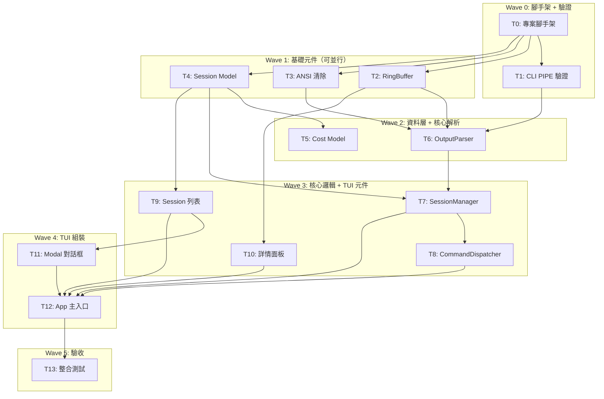

# S3 Implementation Plan: Claude Session Manager (CSM)

> **階段**: S3 實作計畫
> **建立時間**: 2026-03-15 02:30
> **Agent**: architect (python-expert)

---

## 1. 概述

### 1.1 功能目標

開發一個 Python TUI 工具（基於 Textual），用來批量啟動、監控和操控 10+ 個 Claude Code terminal session，在一個畫面內即時掌握所有 session 的 SOP 階段、執行狀態、token 成本，並可直接從 dashboard 對任意 session 發送指令。

### 1.2 實作範圍
- **範圍內**: Session lifecycle 管理、TUI Dashboard 監控面板、Command dispatch 指令派送、Output parser 輸出解析
- **範圍外**: Web dashboard、Claude API 直接查詢、完整日誌儲存、多用戶協作、跨機器遠端管理

### 1.3 關聯文件
| 文件 | 路徑 | 狀態 |
|------|------|------|
| Brief Spec | `./s0_brief_spec.md` | ✅ |
| Dev Spec | `./s1_dev_spec.md` | ✅ |
| Implementation Plan | `./s3_implementation_plan.md` | 📝 當前 |

---

## 2. 實作任務清單

### 2.1 任務總覽

| # | 任務 | 類型 | Agent | 依賴 | 複雜度 | source_ref | TDD | 狀態 |
|---|------|------|-------|------|--------|--------|-----|------|
| 0 | 專案腳手架 | 基礎建設 | `python-expert` | - | S | - | ⛔ | ⬜ |
| 1 | Wave 0: Claude CLI PIPE 模式驗證 | 探索驗證 | `python-expert` | #0 | M | - | ⛔ | ⬜ |
| 2 | RingBuffer 實作 | 工具庫 | `python-expert` | #0 | S | FA-D | ✅ | ⬜ |
| 3 | ANSI escape 清除工具 | 工具庫 | `python-expert` | #0 | S | FA-D | ✅ | ⬜ |
| 4 | Session 資料模型 | 資料層 | `python-expert` | #0 | S | FA-A | ✅ | ⬜ |
| 5 | Cost 追蹤模型 | 資料層 | `python-expert` | #4 | S | FA-B | ✅ | ⬜ |
| 6 | OutputParser 實作 | 核心邏輯 | `python-expert` | #1, #2, #3 | L | FA-D | ✅ | ⬜ |
| 7 | SessionManager 實作 | 核心邏輯 | `python-expert` | #4, #6 | L | FA-A | ✅ | ⬜ |
| 8 | CommandDispatcher 實作 | 核心邏輯 | `python-expert` | #7 | M | FA-C | ✅ | ⬜ |
| 9 | Session 列表 Widget | TUI | `python-expert` | #4 | M | FA-B | ✅ | ⬜ |
| 10 | 詳情面板 Widget | TUI | `python-expert` | #2 | M | FA-B | ✅ | ⬜ |
| 11 | Modal 對話框 | TUI | `python-expert` | #9 | M | FA-B/A/C | ✅ | ⬜ |
| 12 | Textual App 主入口 + 佈局 | TUI | `python-expert` | #7, #8, #9, #10, #11 | L | FA-B | ✅ | ⬜ |
| 13 | 整合測試 + 手動測試計畫 | 測試 | `python-expert` | #12 | M | 全域 | ✅ | ⬜ |

**狀態圖例**：
- ⬜ pending（待處理）
- 🔄 in_progress（進行中）
- ✅ completed（已完成）
- ❌ blocked（被阻擋）
- ⏭️ skipped（跳過）

**複雜度**：S（小，<30min）｜ M（中，30min-2hr）｜ L（大，>2hr）

**TDD**: ✅ = has tdd_plan, ⛔ = N/A (skip_justification required)

---

## 3. 任務詳情

### Task #0: 專案腳手架

**基本資訊**
| 項目 | 內容 |
|------|------|
| 類型 | 基礎建設 |
| Agent | `python-expert` |
| 複雜度 | S |
| 依賴 | - |
| source_ref | - |
| 狀態 | ⬜ pending |

**描述**
建立 `pyproject.toml`（專案名稱 `csm`、依賴 textual >= 0.80、Python >= 3.10）、`src/csm/` 目錄結構、`__init__.py`、`__main__.py` 入口、`.gitignore`。定義 `[project.scripts]` entrypoint `csm = "csm.app:main"`。

**輸入**
- 無前置條件

**輸出**
- 完整的 Python 專案腳手架，可 `pip install -e .` 安裝

**受影響檔案**
| 檔案 | 變更類型 | 說明 |
|------|---------|------|
| `pyproject.toml` | 新增 | 專案元資料、依賴、entrypoint |
| `src/csm/__init__.py` | 新增 | Package init + version |
| `src/csm/__main__.py` | 新增 | `python -m csm` 入口 |
| `src/csm/core/__init__.py` | 新增 | Core 子套件 |
| `src/csm/models/__init__.py` | 新增 | Models 子套件 |
| `src/csm/widgets/__init__.py` | 新增 | Widgets 子套件 |
| `src/csm/utils/__init__.py` | 新增 | Utils 子套件 |
| `src/csm/styles/app.tcss` | 新增 | Textual CSS 樣式（空檔） |
| `.gitignore` | 新增 | Python gitignore |

**DoD（完成定義）**
- [ ] `pyproject.toml` 包含正確的 metadata、dependencies、entrypoint
- [ ] `src/csm/` 目錄結構完整（core/, models/, widgets/, utils/ 子目錄含 `__init__.py`）
- [ ] `pip install -e .` 成功
- [ ] `python -m csm` 可執行（即使只顯示空畫面）

**TDD Plan**: N/A — 純腳手架/設定檔，無可測邏輯。驗證方式為 `pip install -e .` 成功安裝。

**驗證方式**
```bash
pip install -e .
python -m csm
```

**實作備註**
- entrypoint 定義為 `csm = "csm.app:main"`
- `__main__.py` 內容：`from csm.app import main; main()`
- `app.py` 先放一個最簡的 Textual App（空畫面）供驗證

---

### Task #1: Wave 0 — Claude CLI PIPE 模式驗證

**基本資訊**
| 項目 | 內容 |
|------|------|
| 類型 | 探索驗證 |
| Agent | `python-expert` |
| 複雜度 | M |
| 依賴 | Task #0 |
| source_ref | FA-D |
| 狀態 | ⬜ pending |

**描述**
撰寫獨立腳本 `scripts/cli_pipe_test.py`，用 `asyncio.create_subprocess_exec` 以 PIPE 模式啟動 `claude` 互動式 session，驗證 6 項行為：
1. claude CLI 在 stdin PIPE（非 TTY）下是否正常啟動？
2. stdout 輸出的實際格式（ANSI escape？carriage return？）
3. 「等待使用者輸入」時 stdout 的表現
4. 透過 stdin.write 送出指令後的回應格式與延遲
5. Token/cost 資訊呈現方式
6. `--resume` 和 `--continue` 在 PIPE 模式下的行為

**決策閘門（GO/NO-GO）**：
- **GO**: claude CLI 在 PIPE 模式下能正常啟動、stdout 可讀、stdin.write 可送出指令
- **NO-GO**: claude CLI 偵測 isatty() 拒絕運作、stdout 亂碼或無輸出
- **NO-GO 備案**: (1) winpty 模擬 PTY、(2) pexpect popen_spawn、(3) 全部使用 `--print --output-format stream-json` 模式

**輸入**
- Task #0 的專案腳手架
- claude CLI 已安裝且在 PATH

**輸出**
- `scripts/cli_pipe_test.py` 驗證腳本
- `docs/wave0_cli_findings.md` 驗證結果文件

**受影響檔案**
| 檔案 | 變更類型 | 說明 |
|------|---------|------|
| `scripts/cli_pipe_test.py` | 新增 | PIPE 模式驗證腳本 |
| `docs/wave0_cli_findings.md` | 新增 | 驗證結果記錄 |

**DoD（完成定義）**
- [ ] 腳本可執行並成功 spawn claude CLI
- [ ] 6 個驗證項目都有明確結論（含輸出截圖/樣本）
- [ ] 產出 `docs/wave0_cli_findings.md` 文件
- [ ] GO/NO-GO 決策明確記錄
- [ ] 若 NO-GO，提出替代方案並評估可行性

**TDD Plan**: N/A — 探索驗證任務，產出為調查報告和決策文件，無可自動化測試的邏輯。

**驗證方式**
```bash
python scripts/cli_pipe_test.py
# 審閱 docs/wave0_cli_findings.md
```

**實作備註**
- **此任務是阻斷點**：Task #6（OutputParser）的解析策略完全依賴此任務的結論
- 若 NO-GO，需回到 S1 重新設計 OutputParser 策略
- 建議在 Windows Terminal 環境下測試

---

### Task #2: RingBuffer 實作

**基本資訊**
| 項目 | 內容 |
|------|------|
| 類型 | 工具庫 |
| Agent | `python-expert` |
| 複雜度 | S |
| 依賴 | Task #0 |
| source_ref | FA-D |
| 狀態 | ⬜ pending |

**描述**
實作 `src/csm/utils/ring_buffer.py`。固定容量環形緩衝區，使用 `collections.deque(maxlen=N)` 實作。支援 append、批量取得最近 N 行、clear、`__len__`。thread-safe 不需要（單執行緒 asyncio）。

**輸入**
- Task #0 的專案腳手架

**輸出**
- `src/csm/utils/ring_buffer.py` — RingBuffer class
- `tests/test_ring_buffer.py` — 單元測試

**受影響檔案**
| 檔案 | 變更類型 | 說明 |
|------|---------|------|
| `src/csm/utils/ring_buffer.py` | 新增 | RingBuffer 實作 |
| `tests/test_ring_buffer.py` | 新增 | 單元測試 |

**DoD（完成定義）**
- [ ] `RingBuffer` class 實作完成
- [ ] 單元測試覆蓋：append 超出容量自動丟棄舊資料、get_lines 取得正確行數、邊界測試（空 buffer、滿 buffer）
- [ ] 預設容量 1000 行

**TDD Plan**
| 項目 | 內容 |
|------|------|
| test_file | `tests/test_ring_buffer.py` |
| test_command | `python -m pytest tests/test_ring_buffer.py -v` |

**預期測試案例**（RED Phase 先寫）：
- `test_append_within_capacity` — append 不超過容量，get_lines 取得全部
- `test_append_exceeds_capacity` — 超過容量丟棄最舊項目
- `test_get_lines_all` — 不帶參數取得全部行
- `test_get_lines_limited` — 指定 n 取得最近 n 行
- `test_empty_buffer` — 空 buffer 回傳空 list
- `test_clear` — clear 後 len 為 0
- `test_len` — `__len__` 回傳正確長度
- `test_default_capacity` — 預設容量為 1000

**驗證方式**
```bash
python -m pytest tests/test_ring_buffer.py -v
```

---

### Task #3: ANSI escape 清除工具

**基本資訊**
| 項目 | 內容 |
|------|------|
| 類型 | 工具庫 |
| Agent | `python-expert` |
| 複雜度 | S |
| 依賴 | Task #0 |
| source_ref | FA-D |
| 狀態 | ⬜ pending |

**描述**
實作 `src/csm/utils/ansi.py`。提供 `strip_ansi(text: str) -> str` 函式，清除所有 ANSI escape sequence（CSI、OSC、SGR 等）。使用正則 `\x1b\[[0-9;]*[a-zA-Z]` 為基礎，擴展覆蓋 OSC 序列。同時處理 carriage return (`\r`) 覆寫邏輯（模擬終端行為）。

**輸入**
- Task #0 的專案腳手架

**輸出**
- `src/csm/utils/ansi.py` — strip_ansi 函式
- `tests/test_ansi.py` — 單元測試

**受影響檔案**
| 檔案 | 變更類型 | 說明 |
|------|---------|------|
| `src/csm/utils/ansi.py` | 新增 | ANSI stripper 實作 |
| `tests/test_ansi.py` | 新增 | 單元測試 |

**DoD（完成定義）**
- [ ] `strip_ansi` 函式實作完成
- [ ] 處理 CR 覆寫：`"hello\rworld"` → `"world"`
- [ ] 單元測試覆蓋常見 ANSI escape pattern

**TDD Plan**
| 項目 | 內容 |
|------|------|
| test_file | `tests/test_ansi.py` |
| test_command | `python -m pytest tests/test_ansi.py -v` |

**預期測試案例**（RED Phase 先寫）：
- `test_strip_sgr_color` — 移除 SGR 顏色碼 `\x1b[31m`
- `test_strip_sgr_reset` — 移除 reset `\x1b[0m`
- `test_strip_csi_cursor` — 移除游標控制序列
- `test_strip_osc` — 移除 OSC 序列（如視窗標題設定）
- `test_cr_overwrite` — `"hello\rworld"` → `"world"`
- `test_cr_partial_overwrite` — `"hello\rhi"` → `"hillo"`（部分覆寫）
- `test_plain_text_unchanged` — 純文字不變
- `test_mixed_ansi_and_text` — 混合 ANSI 和文字正確 strip

**驗證方式**
```bash
python -m pytest tests/test_ansi.py -v
```

---

### Task #4: Session 資料模型

**基本資訊**
| 項目 | 內容 |
|------|------|
| 類型 | 資料層 |
| Agent | `python-expert` |
| 複雜度 | S |
| 依賴 | Task #0 |
| source_ref | FA-A |
| 狀態 | ⬜ pending |

**描述**
實作 `src/csm/models/session.py`。定義 `SessionState` dataclass 和 `SessionStatus` enum（見 dev_spec 4.2 資料模型）。包含建立 session 的 factory method 和序列化方法。`SessionConfig` dataclass 存放啟動參數（cwd, resume_id, model, permission_mode）以供 restart 使用。

**輸入**
- Task #0 的專案腳手架
- dev_spec 4.2 資料模型定義

**輸出**
- `src/csm/models/session.py` — SessionState, SessionStatus, SessionConfig
- `tests/test_session_model.py` — 單元測試

**受影響檔案**
| 檔案 | 變更類型 | 說明 |
|------|---------|------|
| `src/csm/models/session.py` | 新增 | Session 資料模型 |
| `tests/test_session_model.py` | 新增 | 單元測試 |

**DoD（完成定義）**
- [ ] `SessionState`, `SessionStatus`, `SessionConfig` 定義完成
- [ ] 所有欄位有型別標注
- [ ] factory method `SessionState.create(config: SessionConfig) -> SessionState`
- [ ] 單元測試覆蓋：SessionState.create() factory、SessionStatus enum 各狀態、SessionConfig 預設值

**TDD Plan**
| 項目 | 內容 |
|------|------|
| test_file | `tests/test_session_model.py` |
| test_command | `python -m pytest tests/test_session_model.py -v` |

**預期測試案例**（RED Phase 先寫）：
- `test_session_status_enum_values` — enum 包含 STARTING/RUN/WAIT/DONE/DEAD
- `test_session_config_defaults` — SessionConfig 預設 permission_mode="auto"
- `test_session_state_create` — factory 產出正確的 SessionState
- `test_session_state_create_with_resume` — 帶 resume_id 的 factory
- `test_session_state_fields_typed` — 所有欄位型別正確

**驗證方式**
```bash
python -m pytest tests/test_session_model.py -v
```

---

### Task #5: Cost 追蹤模型

**基本資訊**
| 項目 | 內容 |
|------|------|
| 類型 | 資料層 |
| Agent | `python-expert` |
| 複雜度 | S |
| 依賴 | Task #4 |
| source_ref | FA-B |
| 狀態 | ⬜ pending |

**描述**
實作 `src/csm/models/cost.py`。`CostAggregator` 彙總所有 session 的 token 用量和成本。提供 `update(session_id, tokens_in, tokens_out, cost_usd)` 和 `get_total() -> CostSummary` 方法。

**輸入**
- Task #4 的 SessionState 模型

**輸出**
- `src/csm/models/cost.py` — CostAggregator, CostSummary
- `tests/test_cost_model.py` — 單元測試

**受影響檔案**
| 檔案 | 變更類型 | 說明 |
|------|---------|------|
| `src/csm/models/cost.py` | 新增 | Cost 追蹤模型 |
| `tests/test_cost_model.py` | 新增 | 單元測試 |

**DoD（完成定義）**
- [ ] `CostAggregator` class 實作完成
- [ ] `get_total()` 回傳所有 session 的總計 tokens_in/out、cost_usd
- [ ] 支援移除 session 時清除其成本記錄
- [ ] 單元測試覆蓋：多 session 累加後 get_total() 正確、session 移除後成本扣除、空白狀態回傳 0

**TDD Plan**
| 項目 | 內容 |
|------|------|
| test_file | `tests/test_cost_model.py` |
| test_command | `python -m pytest tests/test_cost_model.py -v` |

**預期測試案例**（RED Phase 先寫）：
- `test_empty_aggregator_returns_zero` — 空白 CostAggregator 的 get_total 回傳全 0
- `test_single_session_update` — 單一 session update 後 get_total 正確
- `test_multiple_sessions_accumulate` — 多 session 累加
- `test_remove_session_deducts_cost` — 移除 session 後 get_total 減少
- `test_update_same_session_replaces` — 同一 session 多次 update 取最新值

**驗證方式**
```bash
python -m pytest tests/test_cost_model.py -v
```

---

### Task #6: OutputParser 實作

**基本資訊**
| 項目 | 內容 |
|------|------|
| 類型 | 核心邏輯 |
| Agent | `python-expert` |
| 複雜度 | L |
| 依賴 | Task #1, #2, #3 |
| source_ref | FA-D |
| 狀態 | ⬜ pending |

**描述**
實作 `src/csm/core/output_parser.py`。基於 Wave 0 驗證結果設計解析策略。初版解析規則：
- **SOP 階段**: 正則匹配 `S[0-7]` 或 `Launching skill: s[0-7]` 等關鍵字
- **Token 用量**: 匹配 `Token usage:` 或 `total_cost` 等模式
- **Session 狀態**: 無輸出超過 N 秒 → WAIT；有持續輸出 → RUN；process exit → DONE/DEAD
- 狀態機管理當前解析上下文
- 每行先經過 `strip_ansi`，再餵給 regex 匹配，結果封裝為 `ParsedEvent`

**輸入**
- Task #1 的 Wave 0 驗證結果（決定解析策略）
- Task #2 的 RingBuffer（儲存原始輸出）
- Task #3 的 strip_ansi（前處理）

**輸出**
- `src/csm/core/output_parser.py` — OutputParser class
- `tests/test_output_parser.py` — 單元測試

**受影響檔案**
| 檔案 | 變更類型 | 說明 |
|------|---------|------|
| `src/csm/core/output_parser.py` | 新增 | OutputParser 實作 |
| `tests/test_output_parser.py` | 新增 | 單元測試 |

**DoD（完成定義）**
- [ ] `OutputParser.parse_line` 實作完成
- [ ] 狀態機正確追蹤 SOP 階段轉換
- [ ] 單元測試使用 Wave 0 捕獲的真實輸出樣本
- [ ] 對無法辨識的行回傳 plain_text 事件（不丟棄）

**TDD Plan**
| 項目 | 內容 |
|------|------|
| test_file | `tests/test_output_parser.py` |
| test_command | `python -m pytest tests/test_output_parser.py -v` |

**預期測試案例**（RED Phase 先寫）：
- `test_parse_sop_stage_s0` — 解析 `S0 需求討論` → sop_stage_change event
- `test_parse_sop_stage_s4` — 解析 `Launching skill: s4-implement` → sop_stage_change
- `test_parse_token_usage` — 解析 token usage 行 → token_update event
- `test_parse_plain_text` — 無法辨識的行 → plain_text event
- `test_strip_ansi_before_parse` — 含 ANSI 的行正確 strip 後解析
- `test_state_machine_transition` — 狀態機正確轉換（idle → parsing → waiting）
- `test_parse_empty_line` — 空行處理

**驗證方式**
```bash
python -m pytest tests/test_output_parser.py -v
```

**實作備註**
- **強依賴 Task #1**：解析規則必須根據 Wave 0 的真實輸出樣本來設計
- 若 Task #1 結果為 NO-GO，此任務的解析策略需要全面調整

---

### Task #7: SessionManager 實作

**基本資訊**
| 項目 | 內容 |
|------|------|
| 類型 | 核心邏輯 |
| Agent | `python-expert` |
| 複雜度 | L |
| 依賴 | Task #4, #6 |
| source_ref | FA-A |
| 狀態 | ⬜ pending |

**描述**
實作 `src/csm/core/session_manager.py`。核心職責：
1. **spawn**: `asyncio.create_subprocess_exec` 啟動 claude CLI，建構正確的命令列參數。啟動 stdout reader asyncio.Task。查重邏輯（E5）。
2. **stop**: `process.terminate()` → `asyncio.wait_for(process.wait(), timeout=5)` → timeout 則 `process.kill()`。清理 reader task。
3. **restart**: 記住 SessionConfig，stop 後重新 spawn。
4. **crash detection**: reader task 偵測到 process exit + returncode != 0 → 標記 DEAD，透過 callback 通知 TUI。
5. Windows 相容：不使用 SIGTERM 常數，用 process.terminate()。路徑正規化。

**輸入**
- Task #4 的 SessionState, SessionConfig 模型
- Task #6 的 OutputParser

**輸出**
- `src/csm/core/session_manager.py` — SessionManager class
- `tests/test_session_manager.py` — 單元測試（mock subprocess）

**受影響檔案**
| 檔案 | 變更類型 | 說明 |
|------|---------|------|
| `src/csm/core/session_manager.py` | 新增 | SessionManager 實作 |
| `tests/test_session_manager.py` | 新增 | 單元測試 |

**DoD（完成定義）**
- [ ] spawn / stop / restart 三個方法實作完成
- [ ] crash detection 正確觸發
- [ ] E4（特殊字元路徑）、E5（重複 session）正確處理
- [ ] stdout reader task 正確啟動和清理
- [ ] Windows 環境下 terminate 行為正確
- [ ] 自動化測試（mock subprocess）覆蓋：spawn 成功路徑、DirectoryNotFoundError、DuplicateSessionError、stop terminate→timeout→kill 路徑、crash detection 觸發 DEAD

**TDD Plan**
| 項目 | 內容 |
|------|------|
| test_file | `tests/test_session_manager.py` |
| test_command | `python -m pytest tests/test_session_manager.py -v` |

**預期測試案例**（RED Phase 先寫）：
- `test_spawn_success` — mock subprocess，spawn 回傳 session_id
- `test_spawn_directory_not_found` — 不存在的目錄 raise DirectoryNotFoundError
- `test_spawn_duplicate_session` — 同目錄同 resume_id 已在跑 raise DuplicateSessionError
- `test_stop_graceful` — terminate 後 process 正常結束
- `test_stop_timeout_force_kill` — terminate 超時後 kill
- `test_restart_preserves_config` — restart 以原 config 重新 spawn
- `test_crash_detection_marks_dead` — process exit code != 0 → status=DEAD
- `test_special_char_path` — 路徑含空白和特殊字元正常 spawn（E4）
- `test_get_sessions` — 回傳所有 session 狀態

**驗證方式**
```bash
python -m pytest tests/test_session_manager.py -v
```

**實作備註**
- 所有 subprocess 操作使用 `asyncio.create_subprocess_exec`（list 參數），永不用 `shell=True`
- Windows 下 `process.terminate()` 等同於 `TerminateProcess`，不是 SIGTERM

---

### Task #8: CommandDispatcher 實作

**基本資訊**
| 項目 | 內容 |
|------|------|
| 類型 | 核心邏輯 |
| Agent | `python-expert` |
| 複雜度 | M |
| 依賴 | Task #7 |
| source_ref | FA-C |
| 狀態 | ⬜ pending |

**描述**
實作 `src/csm/core/command_dispatcher.py`。每個 session 對應一個 `asyncio.Queue(maxsize=50)`（bounded），consumer task 從 queue 取指令並寫入 `process.stdin.write(command.encode() + b"\n")`，加 `drain()`。所有 stdin.write 包在 try/except 中處理 BrokenPipeError（E2）。Session stop/restart 時清空對應 Queue。

**輸入**
- Task #7 的 SessionManager（取得 process handle）

**輸出**
- `src/csm/core/command_dispatcher.py` — CommandDispatcher class
- `tests/test_command_dispatcher.py` — 單元測試

**受影響檔案**
| 檔案 | 變更類型 | 說明 |
|------|---------|------|
| `src/csm/core/command_dispatcher.py` | 新增 | CommandDispatcher 實作 |
| `tests/test_command_dispatcher.py` | 新增 | 單元測試 |

**DoD（完成定義）**
- [ ] `enqueue` 方法正確加入佇列；queue 滿時 raise QueueFullError
- [ ] consumer task 逐一寫入 stdin
- [ ] BrokenPipeError 正確捕捉並觸發 crash 流程
- [ ] session stop/restart 時 consumer task 正確清理，Queue 清空（避免舊指令送入新 session）

**TDD Plan**
| 項目 | 內容 |
|------|------|
| test_file | `tests/test_command_dispatcher.py` |
| test_command | `python -m pytest tests/test_command_dispatcher.py -v` |

**預期測試案例**（RED Phase 先寫）：
- `test_enqueue_success` — 指令成功加入 queue
- `test_enqueue_queue_full` — queue 滿時 raise QueueFullError
- `test_consumer_writes_stdin` — consumer 從 queue 取出並寫入 mock stdin
- `test_broken_pipe_marks_dead` — stdin.write 拋出 BrokenPipeError → 觸發 crash
- `test_cleanup_on_stop` — stop 時 queue 清空、consumer task 取消
- `test_fifo_order` — 多指令按 FIFO 順序送出

**驗證方式**
```bash
python -m pytest tests/test_command_dispatcher.py -v
```

---

### Task #9: Session 列表 Widget

**基本資訊**
| 項目 | 內容 |
|------|------|
| 類型 | TUI |
| Agent | `python-expert` |
| 複雜度 | M |
| 依賴 | Task #4 |
| source_ref | FA-B |
| 狀態 | ⬜ pending |

**描述**
實作 `src/csm/widgets/session_list.py`。使用 Textual `DataTable` widget，欄位：#、Dir（basename）、Stage、Status、$（成本）。支援上下鍵選擇、高亮選中行。行顏色依狀態變化（RUN=綠、WAIT=黃、DEAD=紅、DONE=灰）。

**輸入**
- Task #4 的 SessionState, SessionStatus 模型

**輸出**
- `src/csm/widgets/session_list.py` — SessionListWidget
- `tests/test_session_list.py` — 單元測試（Textual pilot API）

**受影響檔案**
| 檔案 | 變更類型 | 說明 |
|------|---------|------|
| `src/csm/widgets/session_list.py` | 新增 | Session 列表 Widget |
| `tests/test_session_list.py` | 新增 | 單元測試 |

**DoD（完成定義）**
- [ ] DataTable 正確渲染所有 session 行
- [ ] 狀態顏色正確
- [ ] 選中行變更時發出事件（供詳情面板更新）
- [ ] 支援動態新增/移除行

**TDD Plan**
| 項目 | 內容 |
|------|------|
| test_file | `tests/test_session_list.py` |
| test_command | `python -m pytest tests/test_session_list.py -v` |

**預期測試案例**（RED Phase 先寫）：
- `test_render_empty_list` — 無 session 時顯示空表
- `test_render_sessions` — 多個 session 正確渲染為行
- `test_add_session_row` — 動態新增行
- `test_remove_session_row` — 動態移除行
- `test_selection_change_event` — 選中行變更時發出事件

**驗證方式**
```bash
python -m pytest tests/test_session_list.py -v
```

**實作備註**
- 使用 Textual 的 `app.run_test()` pilot API 進行 widget 測試
- 狀態顏色透過 Textual CSS class 或 Rich Style 實作

---

### Task #10: 詳情面板 Widget

**基本資訊**
| 項目 | 內容 |
|------|------|
| 類型 | TUI |
| Agent | `python-expert` |
| 複雜度 | M |
| 依賴 | Task #2 |
| source_ref | FA-B |
| 狀態 | ⬜ pending |

**描述**
實作 `src/csm/widgets/detail_panel.py`。使用 Textual `RichLog` 或自訂 `Static` widget，顯示選中 session 的 ring buffer 內容（最近 100 行）。當 session 選擇變更時切換顯示內容。自動滾動到底部。

**輸入**
- Task #2 的 RingBuffer

**輸出**
- `src/csm/widgets/detail_panel.py` — DetailPanel widget
- `tests/test_detail_panel.py` — 單元測試（Textual pilot API）

**受影響檔案**
| 檔案 | 變更類型 | 說明 |
|------|---------|------|
| `src/csm/widgets/detail_panel.py` | 新增 | 詳情面板 Widget |
| `tests/test_detail_panel.py` | 新增 | 單元測試 |

**DoD（完成定義）**
- [ ] 正確顯示選中 session 的輸出
- [ ] session 切換時內容正確更新
- [ ] 自動滾動到最新輸出
- [ ] 無 session 選中時顯示空白提示

**TDD Plan**
| 項目 | 內容 |
|------|------|
| test_file | `tests/test_detail_panel.py` |
| test_command | `python -m pytest tests/test_detail_panel.py -v` |

**預期測試案例**（RED Phase 先寫）：
- `test_empty_state_shows_placeholder` — 無選中 session 時顯示提示文字
- `test_display_buffer_content` — 正確顯示 RingBuffer 內容
- `test_switch_session_updates_content` — 切換 session 後內容更新
- `test_auto_scroll_to_bottom` — 新內容時自動滾動到底部

**驗證方式**
```bash
python -m pytest tests/test_detail_panel.py -v
```

---

### Task #11: Modal 對話框

**基本資訊**
| 項目 | 內容 |
|------|------|
| 類型 | TUI |
| Agent | `python-expert` |
| 複雜度 | M |
| 依賴 | Task #9 |
| source_ref | FA-B/A/C |
| 狀態 | ⬜ pending |

**描述**
實作 `src/csm/widgets/modals.py`。三個 Modal：
1. **NewSessionModal**: 工作目錄輸入（Input）、resume ID 輸入（可選）、model 選擇（Select）、確認/取消按鈕
2. **ConfirmStopModal**: 「確定停止 Session #N？」+ 確認/取消
3. **CommandInputModal**: 文字輸入框 + 送出/取消

所有 Modal 使用 Textual 的 `ModalScreen` pattern，按 Escape 可關閉。

**輸入**
- Task #9 的 SessionListWidget（Modal 從列表觸發）

**輸出**
- `src/csm/widgets/modals.py` — NewSessionModal, ConfirmStopModal, CommandInputModal
- `tests/test_modals.py` — 單元測試（Textual pilot API）

**受影響檔案**
| 檔案 | 變更類型 | 說明 |
|------|---------|------|
| `src/csm/widgets/modals.py` | 新增 | Modal 對話框 |
| `tests/test_modals.py` | 新增 | 單元測試 |

**DoD（完成定義）**
- [ ] 三個 Modal 都可正確彈出和關閉
- [ ] NewSessionModal 回傳 SessionConfig
- [ ] CommandInputModal 回傳輸入文字
- [ ] Escape 鍵可關閉 Modal

**TDD Plan**
| 項目 | 內容 |
|------|------|
| test_file | `tests/test_modals.py` |
| test_command | `python -m pytest tests/test_modals.py -v` |

**預期測試案例**（RED Phase 先寫）：
- `test_new_session_modal_opens` — NewSessionModal 正確彈出
- `test_new_session_modal_returns_config` — 填入資料後回傳 SessionConfig
- `test_confirm_stop_modal_confirm` — 確認停止回傳 True
- `test_confirm_stop_modal_cancel` — 取消回傳 False
- `test_command_input_modal_returns_text` — 輸入文字後回傳
- `test_escape_closes_modal` — Escape 鍵關閉 Modal

**驗證方式**
```bash
python -m pytest tests/test_modals.py -v
```

---

### Task #12: Textual App 主入口 + 佈局

**基本資訊**
| 項目 | 內容 |
|------|------|
| 類型 | TUI |
| Agent | `python-expert` |
| 複雜度 | L |
| 依賴 | Task #7, #8, #9, #10, #11 |
| source_ref | FA-B |
| 狀態 | ⬜ pending |

**描述**
實作 `src/csm/app.py`。Textual App 主類別，負責：
1. 佈局：左側 session 列表 + 右側詳情面板 + 底部狀態列（水平分割）
2. 快捷鍵綁定（N/X/R/Enter/Q/S/`/`）
3. 初始化 SessionManager、CommandDispatcher、OutputBufferStore
4. 狀態列顯示總成本、session 數量
5. Crash Alert 彈出
6. 退出時優雅關閉所有 session
7. Textual CSS 樣式（`src/csm/styles/app.tcss`）
8. Enter 鍵依 session 狀態分支處理（WAIT→直接輸入、RUN→警告確認、DEAD→提示終止）
9. `/` 鍵篩選（依 status 過濾列表行）、`S` 鍵排序切換（依 cost_usd/stage/status）
10. SESSION_LIMIT 常數（預設 20），超過時狀態列顯示警告

**輸入**
- Task #7 SessionManager
- Task #8 CommandDispatcher
- Task #9 SessionListWidget
- Task #10 DetailPanel
- Task #11 Modals

**輸出**
- `src/csm/app.py` — CSMApp class（覆寫 Task #0 的 placeholder）
- `src/csm/styles/app.tcss` — Textual CSS 樣式（覆寫 Task #0 的空檔）
- `tests/test_app.py` — 整合測試（Textual pilot API）

**受影響檔案**
| 檔案 | 變更類型 | 說明 |
|------|---------|------|
| `src/csm/app.py` | 修改 | 從 placeholder 升級為完整 App |
| `src/csm/styles/app.tcss` | 修改 | 填入實際樣式 |
| `tests/test_app.py` | 新增 | App 層級測試 |

**DoD（完成定義）**
- [ ] 佈局正確（列表+詳情+狀態列）
- [ ] 所有快捷鍵正確觸發對應操作（含 `/` 篩選和 `S` 排序）
- [ ] Enter 鍵依 session 狀態正確分支（WAIT/RUN/DEAD）
- [ ] SessionManager 正確整合
- [ ] 退出時所有 session 正確停止
- [ ] 狀態列即時更新總成本
- [ ] SESSION_LIMIT 超過時顯示警告（E6）

**TDD Plan**
| 項目 | 內容 |
|------|------|
| test_file | `tests/test_app.py` |
| test_command | `python -m pytest tests/test_app.py -v` |

**預期測試案例**（RED Phase 先寫）：
- `test_app_starts` — App 正常啟動不 crash
- `test_layout_has_three_sections` — 佈局含列表、詳情、狀態列
- `test_key_n_opens_new_session_modal` — 按 N 彈出 NewSessionModal
- `test_key_q_triggers_quit` — 按 Q 觸發退出流程
- `test_key_x_opens_confirm_stop` — 按 X 彈出確認停止 Modal
- `test_status_bar_shows_total_cost` — 狀態列顯示總成本
- `test_enter_on_wait_session` — WAIT session 按 Enter 彈出指令輸入
- `test_enter_on_dead_session` — DEAD session 按 Enter 顯示提示

**驗證方式**
```bash
python -m pytest tests/test_app.py -v
# 手動：啟動工具 → 新增 session → 觀察狀態 → 發送指令 → 停止 → 退出
csm
```

---

### Task #13: 整合測試 + 手動測試計畫

**基本資訊**
| 項目 | 內容 |
|------|------|
| 類型 | 測試 |
| Agent | `python-expert` |
| 複雜度 | M |
| 依賴 | Task #12 |
| source_ref | 全域 |
| 狀態 | ⬜ pending |

**描述**
撰寫整合測試腳本和手動測試清單。整合測試用 Textual 的 `app.run_test()` pilot API 模擬鍵盤操作。手動測試清單覆蓋所有成功標準（S0 第 5 節）和六維度例外（E1-E6）。

**輸入**
- Task #12 的完整 App

**輸出**
- `tests/test_integration.py` — 整合測試
- `docs/manual_test_checklist.md` — 手動測試清單

**受影響檔案**
| 檔案 | 變更類型 | 說明 |
|------|---------|------|
| `tests/test_integration.py` | 新增 | 整合測試 |
| `docs/manual_test_checklist.md` | 新增 | 手動測試清單 |

**DoD（完成定義）**
- [ ] 整合測試腳本可執行
- [ ] 手動測試清單覆蓋 7 個成功標準
- [ ] E1-E6 例外都有測試場景

**TDD Plan**
| 項目 | 內容 |
|------|------|
| test_file | `tests/test_integration.py` |
| test_command | `python -m pytest tests/test_integration.py -v` |

**預期測試案例**（RED Phase 先寫）：
- `test_full_lifecycle_spawn_and_stop` — 啟動 App → 新增 mock session → 確認列表更新 → 停止 session
- `test_send_command_to_session` — 選中 session → 送指令 → 確認指令到達 stdin
- `test_crash_detection_flow` — mock process crash → 確認 DEAD 標記 → 確認 Alert 顯示
- `test_multiple_sessions` — 啟動 3 個 mock session → 確認列表顯示 3 行
- `test_keyboard_navigation` — 上下鍵導覽 → 確認選中行變化

**驗證方式**
```bash
python -m pytest tests/test_integration.py -v
# 手動測試：依 docs/manual_test_checklist.md 逐項驗證
```

---

## 4. 依賴關係圖



---

## 5. 執行順序與 Agent 分配

### 5.1 執行波次

| 波次 | 任務 | Agent | 可並行 | 備註 |
|------|------|-------|--------|------|
| Wave 0 | #0 專案腳手架 | `python-expert` | 否 | 序列 — 所有後續任務的基礎 |
| Wave 0 | #1 CLI PIPE 驗證 | `python-expert` | 否（接在 #0 後） | **阻斷點** — GO/NO-GO 決定後續策略 |
| Wave 1 | #2 RingBuffer | `python-expert` | 是（#2, #3, #4 並行） | 獨立工具庫 |
| Wave 1 | #3 ANSI 清除 | `python-expert` | 是（#2, #3, #4 並行） | 獨立工具庫 |
| Wave 1 | #4 Session Model | `python-expert` | 是（#2, #3, #4 並行） | 獨立資料模型 |
| Wave 2 | #5 Cost Model | `python-expert` | 是（#5, #6 並行） | 依賴 #4 |
| Wave 2 | #6 OutputParser | `python-expert` | 是（#5, #6 並行） | 依賴 #1, #2, #3 |
| Wave 3 | #7 SessionManager | `python-expert` | 是（#7, #9, #10 並行） | 依賴 #4, #6 |
| Wave 3 | #9 Session 列表 | `python-expert` | 是（#7, #9, #10 並行） | 依賴 #4（不依賴 #7） |
| Wave 3 | #10 詳情面板 | `python-expert` | 是（#7, #9, #10 並行） | 依賴 #2（不依賴 #7） |
| Wave 3 | #8 CommandDispatcher | `python-expert` | 否（等 #7） | 依賴 #7，必須 #7 完成後 |
| Wave 4 | #11 Modal 對話框 | `python-expert` | 否 | 依賴 #9 |
| Wave 4 | #12 App 主入口 | `python-expert` | 否（等 #7, #8, #9, #10, #11） | 整合所有元件 |
| Wave 5 | #13 整合測試 | `python-expert` | 否 | 依賴 #12 |

### 5.2 波次摘要

| 波次 | 任務數 | 並行策略 | 關鍵路徑 |
|------|--------|---------|---------|
| Wave 0 | 2 (T0→T1) | 序列執行 | T1 是 GO/NO-GO 阻斷點 |
| Wave 1 | 3 (T2, T3, T4) | 全部可並行 | T4 是 Wave 2 的前置 |
| Wave 2 | 2 (T5, T6) | 可並行 | T6 是關鍵路徑（OutputParser） |
| Wave 3 | 4 (T7, T8, T9, T10) | T7/T9/T10 並行，T8 等 T7 | T7→T8 是序列依賴 |
| Wave 4 | 2 (T11, T12) | T11 先，T12 後 | T12 是最終整合 |
| Wave 5 | 1 (T13) | 序列 | 整合驗證 |

### 5.3 Agent 調度指令

```
# Wave 0 — 序列執行
Task(
  subagent_type: "python-expert",
  prompt: "實作 Task #0: 專案腳手架\n\n建立 pyproject.toml、src/csm/ 目錄結構、__init__.py、__main__.py、.gitignore。\n\nDoD:\n- pyproject.toml 包含正確的 metadata、dependencies (textual>=0.80)、entrypoint\n- src/csm/ 目錄結構完整\n- pip install -e . 成功\n- python -m csm 可執行",
  description: "S4-T0 專案腳手架"
)

Task(
  subagent_type: "python-expert",
  prompt: "實作 Task #1: Wave 0 — Claude CLI PIPE 模式驗證\n\n撰寫 scripts/cli_pipe_test.py，驗證 6 項行為。產出 docs/wave0_cli_findings.md。\n\nGO/NO-GO 決策閘門：\n- GO: PIPE 模式可用\n- NO-GO: 偵測 isatty 拒絕\n\nDoD:\n- 腳本可執行\n- 6 個驗證項有結論\n- wave0_cli_findings.md 完成\n- GO/NO-GO 決策明確",
  description: "S4-T1 CLI PIPE 驗證（阻斷點）"
)

# Wave 1 — 並行執行
Task(
  subagent_type: "python-expert",
  prompt: "實作 Task #2: RingBuffer\n\nTDD-first: 先寫 tests/test_ring_buffer.py，再實作 src/csm/utils/ring_buffer.py。\n\nDoD:\n- RingBuffer class 完成\n- 預設容量 1000\n- 單元測試全部通過",
  description: "S4-T2 RingBuffer（TDD）"
)

Task(
  subagent_type: "python-expert",
  prompt: "實作 Task #3: ANSI escape 清除工具\n\nTDD-first: 先寫 tests/test_ansi.py，再實作 src/csm/utils/ansi.py。\n\nDoD:\n- strip_ansi 函式完成\n- CR 覆寫處理正確\n- 單元測試全部通過",
  description: "S4-T3 ANSI 清除（TDD）"
)

Task(
  subagent_type: "python-expert",
  prompt: "實作 Task #4: Session 資料模型\n\nTDD-first: 先寫 tests/test_session_model.py，再實作 src/csm/models/session.py。\n\nDoD:\n- SessionState, SessionStatus, SessionConfig 定義完成\n- factory method 正確\n- 單元測試全部通過",
  description: "S4-T4 Session Model（TDD）"
)

# Wave 2 — 並行執行
Task(
  subagent_type: "python-expert",
  prompt: "實作 Task #5: Cost 追蹤模型\n\nTDD-first: 先寫 tests/test_cost_model.py，再實作 src/csm/models/cost.py。\n\nDoD:\n- CostAggregator 完成\n- get_total() 正確\n- 移除 session 扣除成本\n- 單元測試全部通過",
  description: "S4-T5 Cost Model（TDD）"
)

Task(
  subagent_type: "python-expert",
  prompt: "實作 Task #6: OutputParser\n\n基於 Wave 0 結果設計解析策略。TDD-first。\n\nDoD:\n- parse_line 完成\n- 狀態機正確轉換\n- 使用 Wave 0 真實輸出樣本測試\n- 無法辨識的行回傳 plain_text",
  description: "S4-T6 OutputParser（TDD）"
)

# Wave 3 — T7/T9/T10 並行，T8 等 T7
Task(
  subagent_type: "python-expert",
  prompt: "實作 Task #7: SessionManager\n\nTDD-first。Mock subprocess 測試。\n\nDoD:\n- spawn/stop/restart 完成\n- crash detection 正確\n- E4/E5 處理\n- Windows 相容",
  description: "S4-T7 SessionManager（TDD）"
)

Task(
  subagent_type: "python-expert",
  prompt: "實作 Task #9: Session 列表 Widget\n\nTDD-first。使用 Textual pilot API 測試。\n\nDoD:\n- DataTable 正確渲染\n- 狀態顏色正確\n- 選中行事件\n- 動態增刪行",
  description: "S4-T9 Session 列表 Widget（TDD）"
)

Task(
  subagent_type: "python-expert",
  prompt: "實作 Task #10: 詳情面板 Widget\n\nTDD-first。使用 Textual pilot API 測試。\n\nDoD:\n- 正確顯示 RingBuffer 內容\n- session 切換更新\n- 自動滾動\n- 空白提示",
  description: "S4-T10 詳情面板 Widget（TDD）"
)

# T8 等 T7 完成後
Task(
  subagent_type: "python-expert",
  prompt: "實作 Task #8: CommandDispatcher\n\nTDD-first。\n\nDoD:\n- enqueue + consumer task\n- BrokenPipeError 處理\n- Queue bounded(50)\n- stop/restart 清空 queue",
  description: "S4-T8 CommandDispatcher（TDD）"
)

# Wave 4
Task(
  subagent_type: "python-expert",
  prompt: "實作 Task #11: Modal 對話框\n\nTDD-first。Textual ModalScreen pattern。\n\nDoD:\n- 三個 Modal 正確彈出關閉\n- NewSessionModal 回傳 SessionConfig\n- Escape 關閉",
  description: "S4-T11 Modal 對話框（TDD）"
)

Task(
  subagent_type: "python-expert",
  prompt: "實作 Task #12: Textual App 主入口 + 佈局\n\n整合所有元件。TDD-first。\n\nDoD:\n- 佈局正確\n- 快捷鍵正確\n- Enter 依狀態分支\n- 退出優雅關閉\n- SESSION_LIMIT 警告",
  description: "S4-T12 App 主入口（TDD）"
)

# Wave 5
Task(
  subagent_type: "python-expert",
  prompt: "實作 Task #13: 整合測試 + 手動測試計畫\n\n用 Textual pilot API 整合測試。產出手動測試清單。\n\nDoD:\n- 整合測試可執行\n- 手動測試覆蓋 7 成功標準 + E1-E6",
  description: "S4-T13 整合測試"
)
```

---

## 6. 驗證計畫

### 6.1 逐任務驗證

| 任務 | 驗證指令 | 預期結果 |
|------|---------|---------|
| #0 | `pip install -e . && python -m csm` | 安裝成功、App 可啟動 |
| #1 | `python scripts/cli_pipe_test.py` | 6 項驗證有結論 |
| #2 | `python -m pytest tests/test_ring_buffer.py -v` | All tests passed |
| #3 | `python -m pytest tests/test_ansi.py -v` | All tests passed |
| #4 | `python -m pytest tests/test_session_model.py -v` | All tests passed |
| #5 | `python -m pytest tests/test_cost_model.py -v` | All tests passed |
| #6 | `python -m pytest tests/test_output_parser.py -v` | All tests passed |
| #7 | `python -m pytest tests/test_session_manager.py -v` | All tests passed |
| #8 | `python -m pytest tests/test_command_dispatcher.py -v` | All tests passed |
| #9 | `python -m pytest tests/test_session_list.py -v` | All tests passed |
| #10 | `python -m pytest tests/test_detail_panel.py -v` | All tests passed |
| #11 | `python -m pytest tests/test_modals.py -v` | All tests passed |
| #12 | `python -m pytest tests/test_app.py -v` | All tests passed |
| #13 | `python -m pytest tests/test_integration.py -v` | All tests passed |

### 6.2 整體驗證

```bash
# 全部單元測試
python -m pytest tests/ -v

# 靜態型別檢查（可選）
python -m mypy src/csm/ --ignore-missing-imports

# 手動驗收
csm
# 操作：N 新增 → 觀察列表 → Enter 送指令 → X 停止 → Q 退出
```

---

## 7. 實作進度追蹤

### 7.1 進度總覽

| 指標 | 數值 |
|------|------|
| 總任務數 | 14 |
| 已完成 | 0 |
| 進行中 | 0 |
| 待處理 | 14 |
| 完成率 | 0% |

### 7.2 時間軸

| 時間 | 事件 | 備註 |
|------|------|------|
| 2026-03-15 02:30 | S3 實作計畫完成 | |
| | | |

---

## 8. 變更記錄

### 8.1 檔案變更清單

```
新增：
  (待實作後填寫)

修改：
  (待實作後填寫)

刪除：
  (待實作後填寫)
```

### 8.2 Commit 記錄

| Commit | 訊息 | 關聯任務 |
|--------|------|---------|
| | | |

---

## 9. 風險與問題追蹤

### 9.1 已識別風險

| # | 風險 | 影響 | 緩解措施 | 狀態 |
|---|------|------|---------|------|
| 1 | Claude CLI 在 PIPE 模式下拒絕運作或輸出格式異常 | 高 | Wave 0 驗證（T1）先行確認；NO-GO 備案：winpty/pexpect/stream-json | 監控中 |
| 2 | Textual 在 MSYS_NT/Windows Terminal 渲染問題 | 中 | 限定 Windows Terminal；Textual serve web 模式作為 fallback | 監控中 |
| 3 | 10+ session 同時讀取 stdout 阻塞事件迴圈 | 中 | stdout reader 定期 yield；ring buffer 截斷；必要時用 worker thread | 監控中 |
| 4 | stdin 寫入時 BrokenPipeError | 低 | try/except 包裝所有 stdin.write；觸發 crash 偵測 | 監控中 |
| 5 | Claude CLI 更新導致輸出格式變動 | 中 | OutputParser graceful degradation；parser 規則集中管理 | 監控中 |

### 9.2 問題記錄

| # | 問題 | 發現時間 | 狀態 | 解決方案 |
|---|------|---------|------|---------|
| | | | | |

---

## 10. E2E Test Plan

> 本專案為 Python TUI 工具（非 Web/Mobile），E2E 測試使用 Textual 的 `app.run_test()` pilot API。

### 10.1 Testability 分類

| TC-ID | 描述 | Testability | E2E File | 分配 Task |
|-------|------|-------------|----------|----------|
| TC-1-1 | 啟動新 session（AC-1） | `auto` | `test_integration.py` | T13 |
| TC-1-2 | 停止 session（AC-2） | `auto` | `test_integration.py` | T13 |
| TC-1-3 | 重啟 session（AC-3） | `auto` | `test_integration.py` | T13 |
| TC-1-4 | Dashboard 狀態顯示（AC-4） | `hybrid` | `test_integration.py` | T13 |
| TC-1-5 | 發送指令（AC-5） | `auto` | `test_integration.py` | T13 |
| TC-1-6 | SOP 階段解析（AC-6） | `hybrid` | `test_integration.py` | T13 |
| TC-1-7 | Token 成本追蹤（AC-7） | `hybrid` | `test_integration.py` | T13 |
| TC-1-8 | Crash 偵測（AC-8） | `auto` | `test_integration.py` | T13 |
| TC-1-9 | 篩選排序（AC-9） | `auto` | `test_integration.py` | T13 |
| TC-1-10 | Resume session（AC-10） | `hybrid` | - | T13 (manual) |
| TC-2-1 | 快速連續送指令（E1） | `manual` | - | T13 (manual) |
| TC-2-2 | 送指令時 crash（E2） | `auto` | `test_integration.py` | T13 |
| TC-2-3 | 輸出爆量（E3） | `manual` | - | T13 (manual) |
| TC-2-4 | 特殊字元路徑（E4） | `auto` | `test_session_manager.py` | T7 |
| TC-2-5 | 重複 session（E5） | `auto` | `test_session_manager.py` | T7 |
| TC-2-6 | 系統資源緊繃（E6） | `manual` | - | T13 (manual) |

**Testability 統計**：auto=8, hybrid=4, manual=4

### 10.2 E2E Test Files

| 檔案名稱 | 涵蓋 TC | 分配 Task |
|----------|---------|----------|
| `tests/test_integration.py` | TC-1-1~TC-1-9, TC-2-2 | T13 |
| `docs/manual_test_checklist.md` | TC-1-10, TC-2-1, TC-2-3, TC-2-6 | T13 |

---

## 附錄

### A. 相關文件
- S0 Brief Spec: `./s0_brief_spec.md`
- S1 Dev Spec: `./s1_dev_spec.md`

### B. 參考資料
- [Textual Documentation](https://textual.textualize.io/)
- [Textual Testing Guide](https://textual.textualize.io/guide/testing/)
- [asyncio Subprocess](https://docs.python.org/3/library/asyncio-subprocess.html)

### C. 專案規範提醒

#### Python
- 使用 `src/` layout（`src/csm/`）
- Python 3.10+ 為最低目標
- 所有 I/O 操作走 asyncio
- subprocess 永不用 `shell=True`
- 型別標注所有 public API
- 測試框架：pytest
- TUI 測試：Textual `app.run_test()` pilot API

## SDD Context

```json
{
  "sdd_context": {
    "stages": {
      "s3": {
        "status": "completed",
        "agent": "architect",
        "completed_at": "2026-03-15T02:30:00Z",
        "output": {
          "implementation_plan_path": "dev/specs/claude-session-manager/s3_implementation_plan.md",
          "waves": [
            {
              "wave": 0,
              "name": "腳手架 + CLI PIPE 驗證",
              "tasks": [
                {"id": "T0", "name": "專案腳手架", "agent": "python-expert", "dependencies": [], "complexity": "S", "parallel": false, "tdd_plan": null, "skip_justification": "純腳手架/設定檔，無可測邏輯"},
                {"id": "T1", "name": "Wave 0: Claude CLI PIPE 模式驗證", "agent": "python-expert", "dependencies": ["T0"], "complexity": "M", "parallel": false, "tdd_plan": null, "skip_justification": "探索驗證任務，產出為調查報告"}
              ],
              "parallel": "false — T0→T1 序列執行，T1 是阻斷點"
            },
            {
              "wave": 1,
              "name": "基礎元件",
              "tasks": [
                {"id": "T2", "name": "RingBuffer", "agent": "python-expert", "dependencies": ["T0"], "complexity": "S", "parallel": true, "tdd_plan": {"test_file": "tests/test_ring_buffer.py", "test_cases": ["test_append_within_capacity", "test_append_exceeds_capacity", "test_get_lines_all", "test_get_lines_limited", "test_empty_buffer", "test_clear", "test_len", "test_default_capacity"], "test_command": "python -m pytest tests/test_ring_buffer.py -v"}},
                {"id": "T3", "name": "ANSI escape 清除", "agent": "python-expert", "dependencies": ["T0"], "complexity": "S", "parallel": true, "tdd_plan": {"test_file": "tests/test_ansi.py", "test_cases": ["test_strip_sgr_color", "test_strip_sgr_reset", "test_strip_csi_cursor", "test_strip_osc", "test_cr_overwrite", "test_cr_partial_overwrite", "test_plain_text_unchanged", "test_mixed_ansi_and_text"], "test_command": "python -m pytest tests/test_ansi.py -v"}},
                {"id": "T4", "name": "Session 資料模型", "agent": "python-expert", "dependencies": ["T0"], "complexity": "S", "parallel": true, "tdd_plan": {"test_file": "tests/test_session_model.py", "test_cases": ["test_session_status_enum_values", "test_session_config_defaults", "test_session_state_create", "test_session_state_create_with_resume", "test_session_state_fields_typed"], "test_command": "python -m pytest tests/test_session_model.py -v"}}
              ],
              "parallel": "true — T2, T3, T4 全部可並行"
            },
            {
              "wave": 2,
              "name": "資料層 + 核心解析",
              "tasks": [
                {"id": "T5", "name": "Cost 追蹤模型", "agent": "python-expert", "dependencies": ["T4"], "complexity": "S", "parallel": true, "tdd_plan": {"test_file": "tests/test_cost_model.py", "test_cases": ["test_empty_aggregator_returns_zero", "test_single_session_update", "test_multiple_sessions_accumulate", "test_remove_session_deducts_cost", "test_update_same_session_replaces"], "test_command": "python -m pytest tests/test_cost_model.py -v"}},
                {"id": "T6", "name": "OutputParser", "agent": "python-expert", "dependencies": ["T1", "T2", "T3"], "complexity": "L", "parallel": true, "tdd_plan": {"test_file": "tests/test_output_parser.py", "test_cases": ["test_parse_sop_stage_s0", "test_parse_sop_stage_s4", "test_parse_token_usage", "test_parse_plain_text", "test_strip_ansi_before_parse", "test_state_machine_transition", "test_parse_empty_line"], "test_command": "python -m pytest tests/test_output_parser.py -v"}}
              ],
              "parallel": "true — T5 和 T6 可並行"
            },
            {
              "wave": 3,
              "name": "核心邏輯 + TUI 元件",
              "tasks": [
                {"id": "T7", "name": "SessionManager", "agent": "python-expert", "dependencies": ["T4", "T6"], "complexity": "L", "parallel": true, "tdd_plan": {"test_file": "tests/test_session_manager.py", "test_cases": ["test_spawn_success", "test_spawn_directory_not_found", "test_spawn_duplicate_session", "test_stop_graceful", "test_stop_timeout_force_kill", "test_restart_preserves_config", "test_crash_detection_marks_dead", "test_special_char_path", "test_get_sessions"], "test_command": "python -m pytest tests/test_session_manager.py -v"}},
                {"id": "T9", "name": "Session 列表 Widget", "agent": "python-expert", "dependencies": ["T4"], "complexity": "M", "parallel": true, "tdd_plan": {"test_file": "tests/test_session_list.py", "test_cases": ["test_render_empty_list", "test_render_sessions", "test_add_session_row", "test_remove_session_row", "test_selection_change_event"], "test_command": "python -m pytest tests/test_session_list.py -v"}},
                {"id": "T10", "name": "詳情面板 Widget", "agent": "python-expert", "dependencies": ["T2"], "complexity": "M", "parallel": true, "tdd_plan": {"test_file": "tests/test_detail_panel.py", "test_cases": ["test_empty_state_shows_placeholder", "test_display_buffer_content", "test_switch_session_updates_content", "test_auto_scroll_to_bottom"], "test_command": "python -m pytest tests/test_detail_panel.py -v"}},
                {"id": "T8", "name": "CommandDispatcher", "agent": "python-expert", "dependencies": ["T7"], "complexity": "M", "parallel": false, "tdd_plan": {"test_file": "tests/test_command_dispatcher.py", "test_cases": ["test_enqueue_success", "test_enqueue_queue_full", "test_consumer_writes_stdin", "test_broken_pipe_marks_dead", "test_cleanup_on_stop", "test_fifo_order"], "test_command": "python -m pytest tests/test_command_dispatcher.py -v"}}
              ],
              "parallel": "partial — T7/T9/T10 並行，T8 等 T7"
            },
            {
              "wave": 4,
              "name": "TUI 組裝",
              "tasks": [
                {"id": "T11", "name": "Modal 對話框", "agent": "python-expert", "dependencies": ["T9"], "complexity": "M", "parallel": false, "tdd_plan": {"test_file": "tests/test_modals.py", "test_cases": ["test_new_session_modal_opens", "test_new_session_modal_returns_config", "test_confirm_stop_modal_confirm", "test_confirm_stop_modal_cancel", "test_command_input_modal_returns_text", "test_escape_closes_modal"], "test_command": "python -m pytest tests/test_modals.py -v"}},
                {"id": "T12", "name": "App 主入口 + 佈局", "agent": "python-expert", "dependencies": ["T7", "T8", "T9", "T10", "T11"], "complexity": "L", "parallel": false, "tdd_plan": {"test_file": "tests/test_app.py", "test_cases": ["test_app_starts", "test_layout_has_three_sections", "test_key_n_opens_new_session_modal", "test_key_q_triggers_quit", "test_key_x_opens_confirm_stop", "test_status_bar_shows_total_cost", "test_enter_on_wait_session", "test_enter_on_dead_session"], "test_command": "python -m pytest tests/test_app.py -v"}}
              ],
              "parallel": "false — T11 先，T12 後"
            },
            {
              "wave": 5,
              "name": "驗收",
              "tasks": [
                {"id": "T13", "name": "整合測試 + 手動測試計畫", "agent": "python-expert", "dependencies": ["T12"], "complexity": "M", "parallel": false, "tdd_plan": {"test_file": "tests/test_integration.py", "test_cases": ["test_full_lifecycle_spawn_and_stop", "test_send_command_to_session", "test_crash_detection_flow", "test_multiple_sessions", "test_keyboard_navigation"], "test_command": "python -m pytest tests/test_integration.py -v"}}
              ],
              "parallel": "false"
            }
          ],
          "total_tasks": 14,
          "estimated_waves": 6,
          "verification": {
            "static_analysis": ["python -m mypy src/csm/ --ignore-missing-imports"],
            "unit_tests": ["python -m pytest tests/ -v"]
          }
        }
      }
    }
  }
}
```
